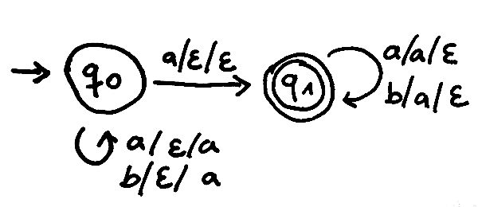

# Übung 6
## Aufgabe 1:
**Die kontextfreie Grammatik $G_1 = (V,\Sigma,R,E)$ mit $V = \{E\}$, $\Sigma = \{o, +, * \}$ und $R = \{E \rightarrow E E + | E E * | o\}$
erzeugt arithmetische Ausdrücke in Umgekehrter Polnischer Notation.**

(a) **Geben Sie eine Ableitung für das Wort o o o++ an.**

$E \Rightarrow_{G_1} EE+ \Rightarrow_{G_1} EEE++ \Rightarrow_{G_1} oEE++$

$\Rightarrow_{G_1} ooE++ \Rightarrow_{G_1} ooo++$

(b) **Geben Sie einen Syntaxbaum für das Wort o o o++o∗o o+∗o+ an.**

(c) **Gehört das Wort o o o o o o o+++∗∗ zu L(G1)?**

*FALSCH: Beweis über Induktion*

*Ansatz: immer ein o mehr als Operatoren*

(d) **Ist die Grammatik G1 eindeutig? Begründen Sie ihre Antwort.**

<<<<<<< HEAD
nein, für das Wort $oo*oo+*$ gibt es zwei Bäume:

=======
nein, für das Wort $oo*oo+*$ gibt es zwei Bäume/Grammatiken:

$E  \Rightarrow_{G_1} EE* \Rightarrow_{G_1} EE*E* \Rightarrow_{G_1} EE*EE+* \Rightarrow_{G_1} oo*oo+*$

$E \Rightarrow_{G_1} EE* \Rightarrow_{G_1} EE* \Rightarrow_{G_1} EEE+* \Rightarrow_{G_1} EE*EE+* \Rightarrow_{G_1} oo*oo+*$

---
*verschiedene Ableitungen können den gleichen Syntaxbaum haben.*

*Ansatz: gnd. wenn eine eindeutige Rechtsableitung existiert*

*Beweis: Grammatik ist eindeutig rechtsableitung, daher ist sie eindeutig*
>>>>>>> origin/master

---
## Aufgabe 2:
**Geben Sie eine kontextfreie Grammatik an, die die Sprache $\{a^ib^jc^kd^l$ | $i = j$ und $k = l$} erzeugt.**
**Geben Sie eine kontextfreie Grammatik an, die die Sprache $\{a^ib^jc^kd^l$ | $i = j$ und $k = l$} erzeugt.**

 $G=(\{S,A,B \}, \{a,b,c,d\}, \{S -> AB, A -> aAb|\epsilon, B -> cBd|\epsilon\},S)$

 $R=\{S \rightarrow AB, A \rightarrow aAb| \varepsilon, B \varepsilon cBd | \varepsilon \}$

---
## Aufgabe 3:
**Sei $G_3 = (\{S,A,B,T\},{a,c},R,S)$ mit $R=\{S \rightarrow AB|BA, A \rightarrow aA|ac, B \rightarrow Tc, T \rightarrow  aT |a\}$**

**Zeigen Sie, dass $G_3$ mehrdeutig ist.**

Das Wort acac lässt sich durch verschiedene Syntaxbäume darstellen:
1. $S \Rightarrow_{G_3} AB \Rightarrow_{G_3} ATc \Rightarrow_{G_3} acTc \Rightarrow_{G_3} acac$
2. $S \Rightarrow_{G_3} BA \Rightarrow_{G_3} Bac \Rightarrow_{G_3} Tcac \Rightarrow_{G_3} acac$
3. $S \Rightarrow_{G3} BA \Rightarrow_{G3} TcA \Rightarrow_{G3} Tcac \Rightarrow_{G3} acac$

---
## Aufgabe 4:
**Konstruieren Sie mit dem Verfahren aus der Vorlesung zur Grammatik G4 = ({A, B, S}, {a, b}, R, S) mit R = {S → aaA, A → BAB | B | ε, B → bb | ε} eine äquivalente Grammatik G in Chomsky Normalform.**

* Gegeben:
 *  $S \rightarrow aaA$
 * $A \rightarrow BAB | B | \varepsilon$
 * $B \rightarrow bb | \varepsilon$

* Elimination von $\varepsilon$-Regeln:
 * $S \rightarrow aaA | aa$
 * $A \rightarrow BAB | B | BB | BA | AB | A$
 * $B \rightarrow bb$

* Elimination von Kettenregelzyklen
 * $A \rightarrow A$ fällt weg

* Elimination von Kettenregeln
 * $S \rightarrow aaA | aa$
 * $A \rightarrow BA | AB | BB | BAB | bb$
 * $B \rightarrow bb$

* Elimination nichtisolierter Terminalsymbole
 * $S \rightarrow T_aT_aA| T_aT_a$
 * $A \rightarrow BA | AB | BB | BAB | T_bT_b$
 * $B \rightarrow T_bT_b$
 * $T_a \rightarrow a$
 * $T_b \rightarrow b$

* Elimination langer rechter Seiten (mehr als 2 Nichtterminaler BAB)
* $S \rightarrow T_aT_aA| T_aT_a$
* $X \rightarrow T_aA$
* $A \rightarrow BA | AB | BB | BY | T_bT_b$
* $Y \rightarrow AB$
* $B \rightarrow T_bT_b$
* $T_a \rightarrow a$
* $T_b \rightarrow b$

Also am Ende:
* zwei Nichtterminale Symbole
* ein Terminales Symbol

---
## Aufgabe 5:
**Geben Sie für die Sprache $\{w \in \{a,b\}^* | w \text{hat ungerade Laenge und das mittlere Symbol ist ein a} \}$
einen Kellerautomaten an, der die Sprache akzeptiert.**

Berechnung (Zustand, Eingabewort, Keller):

$(q_0, bab, \epsilon)$
$\vdash_M (q_0, ab, a)$
$\vdash_M (q_1, b, a)$
$\vdash_M (q_1, \epsilon, \epsilon)$

Werte die auf den Stack kommen dürfen müsen im Stapelalphabet definiert werden.

*Aus Vorlesung:*
jede kontextfreie Sprache lässt sich durch einen Automaten mit nur zwei Zuständen umsetzen.

---
## Aufgabe 6:
**Sei M der durch das folgende Diagramm gegebene Kellerautomat.**

(a) **Geben Sie eine akzeptierende Berechnung für das Wort baabbabb an.**

* $((s,a,b),(s,\varepsilon))$
* $((s,a,\varepsilon),(s,a))$
* $((s,b,a),(s,\varepsilon))$
* $((s,b,\varepsilon),(s,b))$
* $((s,a,b),(p,\varepsilon))$
* $((s,a,\varepsilon),(p,a))$
* $((p,\varepsilon,\varepsilon),(s,a))$
* $((p,\varepsilon, b),(s,\varepsilon))$

Bitte noch vervollständigen:

$(s,baabbabb, \epsilon)$
$\vdash_M (s, aabbabb, b)$
$\vdash_M (p, abbabb, \epsilon)$
$\vdash_M (s, abbabb, a)$
$\vdash_M (s, bbabb, aa)$
$\vdash_M (s, babb, aaa)$

|| Zustand | Input| Keller|
|:---: |:---: |:---: |:---: |:---: |
| | s | baabbabb | $\varepsilon$ |
|  | s |  aabbabb |       b|
|  | p |   abbabb | $\varepsilon$       |
|  | p |   abbabb |       a       |
|  | p |    bbabb |      aa       |
|  | s |     babb |     aaa       |
|  | s |      abb |      aa       |
|  | s |       bb |     baa       |
|        | s |        b |      aa       |
|        | s | $\varepsilon$ |  a       |

(b) **Welches ist die von M akzeptierte Sprache L(M)?**

Wenn man in s bliebt: $|w|_a = |w|_b$

Reise zu p: $|w|_a = |w|_b$

$L(M)=\{w \in \{a,b\}^* | 1*|w|_a \leq |w|_b \leq 2*|w|_a \}$
