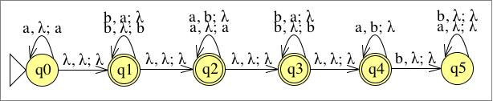
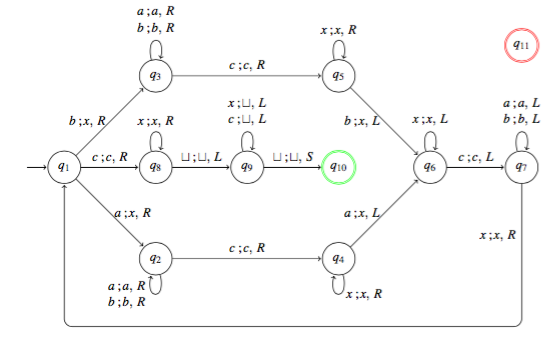

# Übung 9
## Aufgabe 1:
**Geben Sie eine Turingmaschine an, die die Sprache $L(a^*b^*a^*b^*a^*)$ akzeptiert.**

-> Maschine akzeptiert und entscheidet

q6 = reject

---
## Aufgabe 2:
**Zeigen Sie, dass die Sprache $L = \{a^{2^k} | k \geq 0\}$ nicht kontextfrei ist.**

$L=\{a^{2^k}\}|k \geq 0\}$

$z=uvwxy$, z besteht nur aus a's

$z=a^{2^n}$

* 1.Fall:

 $u,v,w,x,y \in \varepsilon$

 $\begin{matrix}
u=a^m \\
vwx=a^{2^n}-m-l \\
y=a^l
\end{matrix}$

 für $i=2:z'=a^ma^{2^n-m-l}a^la^{|v|}a^{|x|}=a^{2^{n}+|v|+|x|}$

 $2^n<2^n+|v|+|x|<2(2^n)$

---
## Aufgabe 3:
**Beweisen oder widerlegen Sie: Die Sprache $L=\{a^ib^ja^kb^la^m |i+k+m= j+l\}$ ist kontextfrei.**

oder:

$L=\{w | |w|_ a =|w|_ b\}\cap L(a^* b^* a^* b^* a^* )$

---
## Aufgabe 4:
**Begründen Sie jeweils ihre Antwort auf die folgenden Fragen:**
a) **Ist die Klasse der rekursiven Sprachen abgeschlossen unter Konkatenation?**

ja->

b) **Ist die Klasse der rekursiven Sprachen abgeschlossen unter Kleene Star?**

->ja

---
## Aufgabe 5:
**Sei M die durch folgendes Zustandsübergangsdiagramm gegebene Turingmaschine, die die Sprache $L = \{wcw | w \in \{a,b\}^*\}$ akzeptiert. In der Vorlesung haben wir ein Konstruktionsverfahren kennengelernt, um aus M eine Grammatik G zu erzeugen mit $L(G) = L(M) = L$. Geben Sie eine Ableitung für das Wort *abcab* in der entsprechend des Verfahren konstruierten Grammatik G an. Sie brauchen hier nur jene Produktionsregeln der Grammatik zu erzeugen, die Sie für die Ableitung benötigen.**

NICHT VOTIEREN!

Regeln:
$\delta (q,a)=(p,b,S)\Rightarrow pb \rightarrow qa$

| Berechnung | Ableitung |
| ---------- | --------- |
| $(\varepsilon, q_1,abcab)$ | $\vdash_M (x,q_2,bcab)$ | $S \Rightarrow_G \vartriangleright q_{10}\vartriangleleft$ |
|  | $\vdash_M (xb,q_2,cab)$ | $\Rightarrow_G \vartriangleright q_{10}\sqcup$
|  | $\vdash_M (x,q_2,bcab)$ |
|  | $\vdash_M (x,q_2,bcab)$ |
|  | $\vdash_M (x,q_2,bcab)$ |

---
## Aufgabe 6:
**Sei $\Sigma=\{a,b\}$ und sei $f:\Sigma^* \rightarrow \Sigma^* $ mit:**
$$f(w) = w^R$$
**Geben Sie eine Turingmaschine an, die die Funktion f berechnet.**

