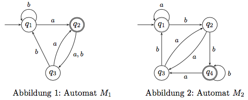

# Übung 02
## 1. Es seien die Menge $M = \{a,b,c,d,e\}$ sowie die Relation $R\subseteq M_2$, definiert durch $R = \{(a, b), (a, c), (a, d), (d, c), (d, e)\}$, gegeben.
* **a) Bestimmen Sie die reflexive und transitive Hülle $R^* $ der Relation R.**

* **b) Zeichnen Sie die gerichteten Graphen $G = (M, R)$ und $G^* = (M, R^* )$.**

---

## 2.
* **a) Beweisen Sie, dass die Menge der Wörter über einem Alphabet abzählbar unendlich ist.**

* **b) Beweisen Sie, dass die Menge der Sprachen über einem Alphabet überabzählbar unendlich ist.**

---

## 3. Beweisen Sie durch vollständige Induktion, dass die Ungleichung $n^2 > 2n + 1$ für alle natürlichen Zahlen $n\geq 3$ gilt.

---

## 4. Es sei $\sum = \{a, b\}$. Wir definieren eine Sprache L über $\sum$ induktiv wie folgt.
(1) ε gehört zu L.
(2) Falls $x \in L$ ist, dann gehört auch abxb zu L.
(3) Falls $x\in L$ ist, dann gehört auch bxba zu L.
(4) Falls $x\in L$ und $y\in L$,dann gehört auch xy zu L.

**Beweisen Sie durch strukturelle Induktion, dass alle Wörter in L doppelt so viele b wie a enthalten.**

---

## 5. In der Vorlesung sitzen n Studenten, n ≥ 2, die sich teilweise gegenseitig kennen. Zeigen Sie, dass es zwei verschiedene Studenten gibt, die mit gleich vielen anderen Studenten bekannt sind.

---

## 6. Es seien die folgenden Zustandsdiagramme deterministischer endlicher Automaten $M_1$ und $M_2$ gegeben.

* **a) Geben Sie formale Beschreibungen der Automaten M1 und M2 an.**

* **b) Geben Sie für beide Automaten die Folge der Konfigurationen bei der Verarbeitung der Ein-
gabe aabb an.**

* **c) Wird jeweils das Wort aabb akzeptiert? Begründen Sie ihre Antwort.**

* **d) Wird jeweils das leere Wort ε akzeptiert? Begründen Sie ihre Antwort.**
