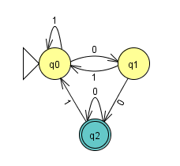
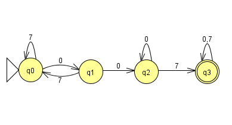
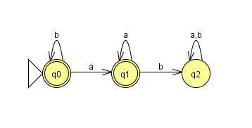
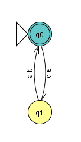
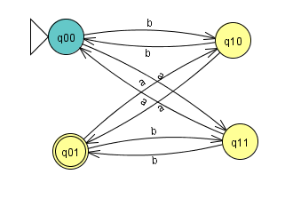
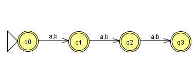
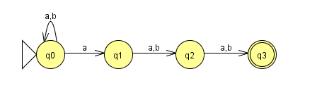

# Übungsblatt 03
## 1. Beweisen oder widerlegen Sie folgende Behauptungen über Sprachen.

* a) $\forall L_1,L_2,L_3:(L_1 \cup L_2)L_3=L_1L_3\cup L_2L_3$
-> wahr, Distributivität
Konkatination: $L_1L_2=\{w \in \Sigma^* | x\in L_1 \land y\in L_2 \rightarrow w=yx\}$
Vereinigung: $L_1 \cup L_2=\{w \in \Sigma^* | w\in L_1 \lor w\in L_2\}$
$(L_1\cup L_2)L_3$
$=\{w\in \Sigma^* | w_1\in \Sigma^* (w_1\in L_1 \lor w_1 \in L_2)\land w_2\in \Sigma^* (w_2 \in \Sigma^* )\rightarrow w=w_1w_2\}$
$=\{w\in \Sigma^* | (w_1\in L_1 \land w_1\in L_3) \lor (w_1 \in L_2 \land w_2 \in L_3)\rightarrow w=w_1w_2\}$
$=L_1L_3\cup L_2L_3$

* b) $\forall L_1,L_2,L_3:(L_1\cap L_2)L_3=L_1L_3\cap L_2L_3$
-> falsch
Gegenbeispiel:
$L_1=\{a\},L_2=\{aa\},L_3=\{\varepsilon, a\}$
$l.S.:(L_1\cap L_2)L_3=\emptyset * L_3=\{a\}$
$r.S.:L_1L_3\cap L_2L_3=\{a,aa\}\cap \{aa,aaa\}=\{aa\}$
* c) $\forall L_1,L_2:(L_1\cup L_2)^* =L_1^* \cup L_2^* $
-> falsch
Gegenbeispiel:
$L_1=\{a\},L_2=\{b\}$
$(L_1\cup L_2)^* $ -> abab ist möglich
$L_1^* \cup L_2^* $ -> abab nicht möglich
* d) $\forall L_1, L_2:(L_1L_2)^* =L_1^* L_2^* $
-> falsch
Gegenbeispiel:
$L_1=\{a\},L_2=\{b\}$
$(\{a,b\})^* \neq \{a\}^* \{b\}^* $

---

## 2. Welche der folgenden Behauptungen über Sprachen sind wahr, welche falsch? Begründen Sie Ihre Antwort.
* a) $\forall L:(L^+ )^* = L^* $
-> wahr, da $L^+ = L^* \cap \{\varepsilon \}$

* b) $\forall L_1,L_2 : (L_1 =L_2 \Leftrightarrow L_1^* =L_2^* )$
-> wahr
* c) $\forall L_1, L_2 : L_1L_1^* L_2 \subseteq L_1^* L_2$
-> richtig
$L_1^{n+1}L_2\subseteq L_1^nL_2$ $n\in \mathbb{N}_0$
Gegenbeispiel:
$L_1=\{a\} L_2=\{b\}$
$ab\subseteq b$
* d) $\forall L_1, L_2 : L_1^* L_2 \subseteq L_1L_1^* L_2$
-> falsch

---

## 3. Geben Sie jeweils Zustandsdiagramme deterministischer endlicher Automaten an, die die folgenden Sprachen akzeptieren.
* a) $\{w\in \{0,1\}^* | w\text{ hat das Suffix } 00\}$

* b) $\{w \in \{0, 7\}^* | w \text{ enthaelt das Teilwort } 007\}$

* c) $\{w \in \{a, b\}^* | w \text{ enthaelt das Teilwort ab nicht}\}$

---

## 4. Geben Sie das Zustandsdiagramm eines deterministischen endlichen Automaten an, der die Sprache $\{w \in \{a, b\}^* | w \text{ hat gerade Laenge und enthaelt ungeradzahlig viele a}\}$ akzeptiert.
*Diese Sprache ist der Schnitt zweier regulärer Sprachen. Konstruieren Sie zunächst deterministische endliche Automaten für diese Teilsprachen und kombinieren Sie dann die beiden Automaten wie in der Vorlesung angegeben.*

| $q_i$ | | a | b |
| --- | --- | :---: | :---: |
| $q_0$ | | $q_1$ | $q_1$ |
| $q_1$ | | $q_0$ | $q_0$ |

| $q_j$ | | a | b |
| --- | --- | :---: | :---: |
| $q_0$ | | $q_1$ | $q_0$ |
| $q_1$ | | $q_0$ | $q_1$ |

$q_{ij}=(q_i,q_j): $

| $q_{ij}$ | | a | b |
| --- | --- | :---: | :---: |
| $q_{00}$ | | $q_{11}$ | $q_{10}$ |
| $q_{01}$ | | $q_{10}$ | $q_{11}$ |
| $q_{10}$ | | $q_{01}$ | $q_{00}$ |
| $q_{11}$ | | $q_{00}$ | $q_{01}$ |

---

## 5. Geben Sie jeweils Zustandsdiagramme (nichtdeterministischer) endlicher Automaten an, die die folgenden Sprachen akzeptieren.

Def. $NEA=(\{K,\Sigma , \Delta , s,F\})$
* K ist endliche Menge an Zuständen
* $\Sigma$ ist ein Alphabet
* $s \in K$ ist der Startzustand
* $\Delta$ ist die Überführungsrelation
* $F \subseteq K$ ist die Menge der Endzuständen

Wir erlauben nun,
* dass es keinen Nachfolgezustand für ein Symbol gibt
* dass es mehr als einen Nachfolgezustand für ein Symbol gibt
* dass es Übergänge gibt, ohne dass ein Symbol gelesen wird

Die Klasse der von nichtdeterministischen endlichen Automaten akzeptierten Sprachen ist abgeschlossen unter
* Vereinigung,
* Konkatenation
* Kleene-Star

* a) $\{w\in \{a,b\}^* ||w|\leq 3\}$

* b) $\{w \in \{a,b\}^* | |w| \geq 3 \land \text{ das drittletzte Symbol in w ist ein a}\}$

* c) $\{w \in \{a, b\}^* | w \text{ enthaelt das Teilwort aa oder das Teilwort bb}\}$

---

## 6. Konstruieren Sie mit dem Verfahren aus dem Beweis der Äquivalenz von NEA und DEA zu dem nichtdeterministischen endlichen Automaten, der durch den folgenden Zustandsgraphen gegeben ist, einen äquivalenten deterministischen Automaten.
*Sie brauchen dabei nicht alle Zustände, die sich aus der Potenzmengenkonstruktion ergeben, zu konstruieren, sondern nur die vom Startzustand aus erreichbaren.*

$NEA=(\{q_1,q_2,q_3\},\{a,b\},\Delta ,q_1,\{q_3\})$

1. Epsilonabschluss
*Alle Zustände, die wir ohne Eingabe erreichen*

| $q$ | $q_1$ | $q_2$ | $q_3$ |
| :------: | :---: | :---: | :---: |
| $E(q)$ | $\{q_1\}$ | $\{q_2\}$ | $\{q_3\}$ |

2. Übergangstabelle

| $\delta$ |   | a | b |
| :------: | :---: | :---: | :---: |
| $\{q_1\}$ |   | $\{q_1,q_2\}$ | $\{q_1\}$ |
| $\{q_2\}$ |   | $\{q_3\}$ | $\{q_3\}$ |
| $\{q_3\}$ |   | $\emptyset$ | $\emptyset$ |
| $\{q_1,q_2\}$ |   | $\{q_1,q_2,q_3\}$ | $\{q_1,q_3\}$ |
| $\emptyset$ |   | $\emptyset$ | $\emptyset$ |
| $\{q_1,q_2,q_3\}$ |   | $\{q_1,q_2,q_3\}$ | $\{q_1,q_3\}$ |
| $\{q_1,q_3\}$ |   | $\{q_1,q_2\}$ | $\{q_1\}$ |
