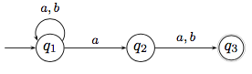

# Übungsblatt 03
## 1. Beweisen oder widerlegen Sie folgende Behauptungen über Sprachen.

* a) $\forall L_1,L_2,L_3:(L_1 \cup L_2)L_3=L_1L_3\cup L_2L_3$
-> wahr, Distributivität
* b) $\forall L_1,L_2,L_3:(L_1\cap L_2)L_3=L_1L_3\cap L_2L_3$
-> falsch
Gegenbeispiel:
$L_1=\{a\},L_2=\{aa\},L_3=\{\varepsilon, a\}$
$l.S.:(L_1\cap L_2)L_3=\emptyset * L_3=\{a\}$
$r.S.:L_1L_3\cap L_2L_3=\{a,aa\}\cap \{aa,aaa\}=\{aa\}$
* c) $\forall L_1,L_2:(L_1\cup L_2)^* =L_1^* \cup L_2^* $
-> falsch
Gegenbeispiel:
$L_1=\{a\},L_2=\{b\}$
$(L_1\cup L_2)^* $ -> abab ist möglich
$L_1^* \cup L_2^* $ -> abab nicht möglich
* d) $\forall L_1, L_2:(L_1L_2)^* =L_1^* L_2^* $
-> falsch
Gegenbeispiel:
$L_1=\{a\},L_2=\{b\}$
$(\{a,b\})^* \neq \{a\}^* \{b\}^* $

---

## 2. Welche der folgenden Behauptungen über Sprachen sind wahr, welche falsch? Begründen Sie Ihre Antwort.
* a) $\forall L:(L^+ )^* = L^* $
-> wahr, da $L^+ = L^* \cap \{\varepsilon \}$

* b) $\forall L_1,L_2 : (L_1 =L_2 \Leftrightarrow L_1^* =L_2^* )$
-> wahr
* c) $\forall L_1, L_2 : L_1L_1^* L_2 \subseteq L_1^* L_2$
* d) $\forall L_1, L_2 : L_1^* L_2 \subseteq L_1L_1^* L_2$

---

## 3. Geben Sie jeweils Zustandsdiagramme deterministischer endlicher Automaten an, die die folgenden Sprachen akzeptieren.
* a) $\{w\in \{0,1\}^* | w\text{ hat das Suffix } 00\}$
* b) $\{w \in \{0, 7\}^* | w \text{ enthaelt das Teilwort } 007\}$
* c) $\{w \in \{a, b\}^* | w \text{ enthaelt das Teilwort ab nicht}\}$

---

## 4. Geben Sie das Zustandsdiagramm eines deterministischen endlichen Automaten an, der die Sprache $\{w \in \{a, b\}^* | w \text{ hat gerade Laenge und enthaelt ungeradzahlig viele a}\}$ akzeptiert.
*Diese Sprache ist der Schnitt zweier regulärer Sprachen. Konstruieren Sie zunächst deterministische endliche Automaten für diese Teilsprachen und kombinieren Sie dann die beiden Automaten wie in der Vorlesung angegeben.*

---

## 5. Geben Sie jeweils Zustandsdiagramme (nichtdeterministischer) endlicher Automaten an, die die folgenden Sprachen akzeptieren.
* a) $\{w\in \{a,b\}^* ||w|\leq 3\}$
* b) $\{w \in \{a,b\}^* | |w| \geq 3 \land \text{ das drittletzte Symbol in w ist ein a}\}$
* c) $\{w \in \{a, b\}^* | w \text{ enthaelt das Teilwort aa oder das Teilwort bb}\}$

---

## 6. Konstruieren Sie mit dem Verfahren aus dem Beweis der Äquivalenz von NEA und DEA zu dem nichtdeterministischen endlichen Automaten, der durch den folgenden Zustandsgraphen gegeben ist, einen äquivalenten deterministischen Automaten.
*Sie brauchen dabei nicht alle Zustände, die sich aus der Potenzmengenkonstruktion ergeben, zu konstruieren, sondern nur die vom Startzustand aus erreichbaren.*

