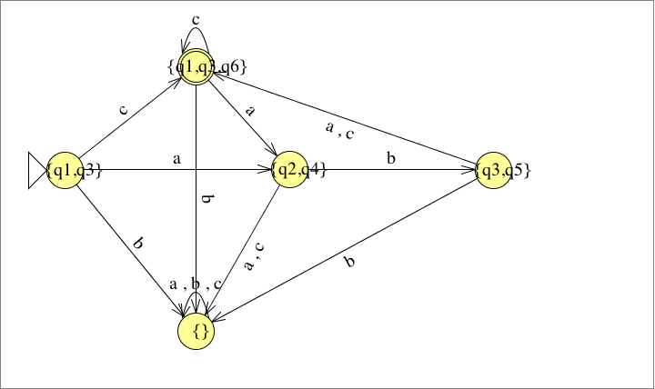
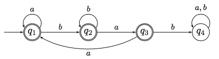

# Übungsblatt 04
## 1. Konstruieren Sie mit dem Verfahren aus dem Beweis der Äquivalenz von NEA und DEA zu dem nichtdeterministischen endlichen Automaten, der durch den folgenden Zustandsgraphen gegeben ist, einen äquivalenten deterministischen endlichen Automaten.
*Sie brauchen dabei nicht alle Zustände, die sich aus der Potenzmengenkonstruktion ergeben, zu konstruieren, sondern nur die vom Startzustand aus erreichbaren.*

1. Epsilonabschluss

| $q$ | $q_1$ | $q_1$ | $q_1$ | $q_1$ | $q_1$ | $q_1$ |
| --- | --- | --- | --- | --- | --- | --- |
| $E(q)$ | $\{q_1,q_3\}$ | $\{q_2\}$ | $\{q_3\}$ | $\{q_4\}$ | $\{q_5\}$ | $\{q_1,q_3, q_6\}$ |

2. Zustandsübergänge

| $\delta$ | a | b | c |
| --- | --- | --- | --- |
| $\{q_1\}$ | $\{q_2,q_4\}$ | $\emptyset$ | $\emptyset$ |
| $\{q_2\}$ | $\emptyset$ | $\{q_3\}$ | $\emptyset$ |
| $\{q_3\}$ | $\emptyset$ | $\emptyset$ | $\{q_1,q_3,q_6\}$ |
| $\{q_4\}$ | $\emptyset$ | $\{q_5\}$ | $\emptyset$ |
| $\{q_5\}$ | $\{q_1,q_3,q_6\}$ | $\emptyset$ | $\emptyset$ |
| $\{q_6\}$ | $\emptyset$ | $\emptyset$ | $\emptyset$ |

3. neue Zustände

| $\delta$ | a | b | c |
| --- | --- | --- | --- |
| $\{q_1,q_3\}$ | $\{q_2,q_4\}$ | $\emptyset$ | $\{q_1,q_3,q_6\}$ |
| $\{q_2,q_4\}$ | $\emptyset$ | $\{q_3,q_5\}$ | $\emptyset$ |
| $\{q_1,q_3,q_6\}$ | $\{q_2,q_4\}$ | $\emptyset$ | $\{q_1,q_3,q_6\}$ |
| $\{q_3,q_5\}$ | $\{q_1,q_3,q_6\}$ | $\emptyset$ | $\{q_1,q_3,q_6\}$ |
| $\emptyset$ | $\emptyset$ | $\emptyset$ | $\emptyset$ |

$F=\{\{q_1,q_3,q_6\}\}$

---

## 2. Es sei $\Sigma$ ein Alphabet. Begründen Sie: Wenn eine Sprache $L \subseteq \Sigma ^* $ von einem nichtdeterministischen endlichen Automaten akzeptiert wird, dann existiert auch ein nichtdeterministischer endlicher Au tomat, der die Sprache $L^R$ akzeptiert.

zu zeigen ist: $\Rightarrow \exists M: L=L(M) \Rightarrow \exists M': L^* =L(M')$
$$\forall x \in \Delta$$
$$\Delta' : (p,a,q)\in \Delta \Rightarrow (q,a,p) \in \Delta' $$

---

## 3. Sei $\Sigma =\{a,b\}$. Geben Sie reguläre Ausdrücke für die folgenden Sprachen an.
*Sie dürfen dabei, wie in der Vorlesung angegeben, Klammern einsparen.*

Def. regulärer Ausdruck: ist ein Ausdruck über $w \in (\Sigma \cup \{(,),\emptyset, \cup, * \})^* $
(1) $a\in \Sigma \Rightarrow a \in RA$
(2) $\emptyset \in RA$
(3) $\alpha , \beta \in RA \Rightarrow (\alpha \beta) \in RA$
(4) $\alpha \in RA \Rightarrow \alpha^* \in RA$
(5) $\alpha,\beta \in RA \Rightarrow (\alpha \cup \beta)\in RA$

* a) $\{w\in \Sigma ^* | w \text{ enthaelt hoechstens zwei a}\}$
$L=(b^* (a\cup \varepsilon)b^* (a \cup \varepsilon) b^* )$
* b) $\{w\in \Sigma ^* | w \text{ enthaelt geradzahlig viele a}\}$
$L=((b^* ab^* a)^* \cup b^* )$
* c) $\{w\in \Sigma ^* | w \text{ enthaelt das Teilwort ab}\}$
$L=((a\cup b)^* ab(a\cup b)^* )$
* d) $\{w\in \Sigma ^* | w \text{ enthaelt das Teilwort ab nicht}\}$
$L=(b^* a^* )$

---

## 4. Sei $\Sigma =\{a,b\}$. Geben Sie reguläre Ausdrücke für die folgenden Sprachen an.
*Sie dürfen dabei, wie in der Vorlesung angegeben, Klammern einsparen.*

* a) $\{w\in \Sigma ^* | w \text{ enthaelt sowohl ab als auch ba als Teilwort}\}$
$L=((a\cup b)^* abb^* a(a\cup b)^* \cup (a\cup b)^* baa^* b(a\cup b)^* )$
oder $(a^* abb^* a(a\cup b)^* \cup b^* baa^* b(a\cup b)^* )$
* b) $\{w\in \Sigma ^* | w \text{ enthaelt kein Teilwort bb}\}$
$L=((a \cup ba)^* (b\cup \varepsilon))$
* c) $\{w\in \Sigma ^* | \text{ in w stehen alle Teilwoerter aa vor allen Teilwoertern bb}\}$
$L=((ba\cup a)^* (ab\cup b)^* (\varepsilon \cup a))$

---

## 5. Benutzen Sie die in der Vorlesung vorgestellten Konstruktionen, um für die Sprache, die von dem deterministischen endlichen Automaten mit folgendem Zustandsgraphen akzeptiert wird, einen regulären Ausdruck zu konstruieren, der sie beschreibt.

Schritte zur Erstellung:
1. Entfernen einen Selbstbezugs:
$$R_i\equiv \beta R_i \cup \gamma \Rightarrow R_i\equiv \beta^* \gamma$$

2. Entfernen von Variablen
$$R_i \equiv \alpha, R_j \equiv \beta R_i \cup \gamma $$
$$\Rightarrow R_j \equiv \beta \alpha \cup \gamma$$

Gleichungssystem:
I) $R_1\equiv aR_1\cup bR_2$
II) $R_2\equiv aR_3\cup bR_2$
III) $R_3\equiv aR_1 \cup bR_4$
IV) $R_4\equiv abR_4 \cup \varepsilon$

1. Entfernen von Selbstbezug in IV
IV') $R_4 \equiv (ab)^* \varepsilon$

2. (IV' in III)
III') $R_3\equiv aR_1 \cup b(ab)^* \varepsilon$

3. Entfernen von Selbstbezug in II
II') $R_2\equiv b^* aR_3$

4. (III' in II')
II'') $R_2 \equiv b^* aaR_1 \cup b(ab)^* \varepsilon$

5. Entfernen von Selbstbezug in I
I') $R_1 \equiv a^* bR_2$

6. (II'' in I')
I'') $R_1 \equiv a^* bb^* aaR_1\cup b(ab)^* \varepsilon$

7. Entfernen von Selbstbezug in I''
I''') $R_1\equiv (a^* bb^* aa)^* b(ab)^* \varepsilon$

---
