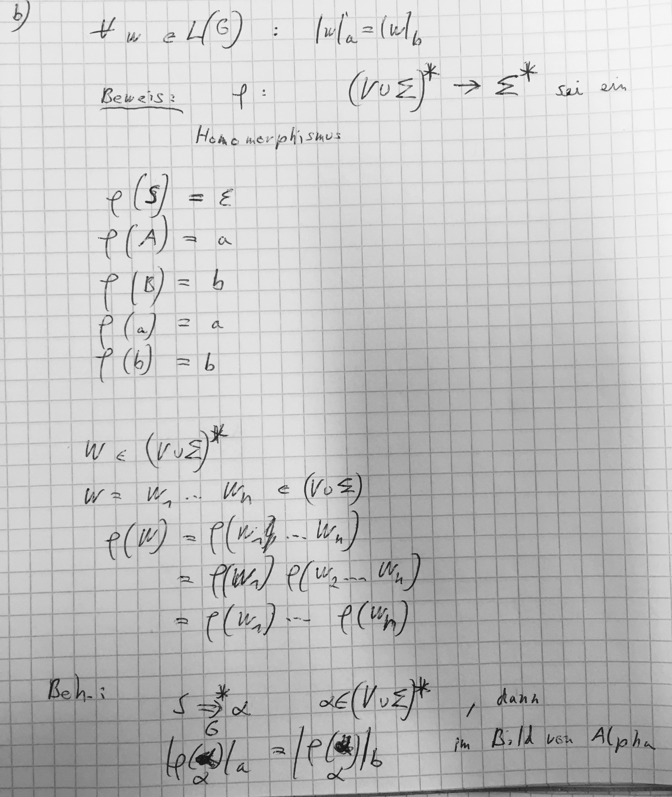
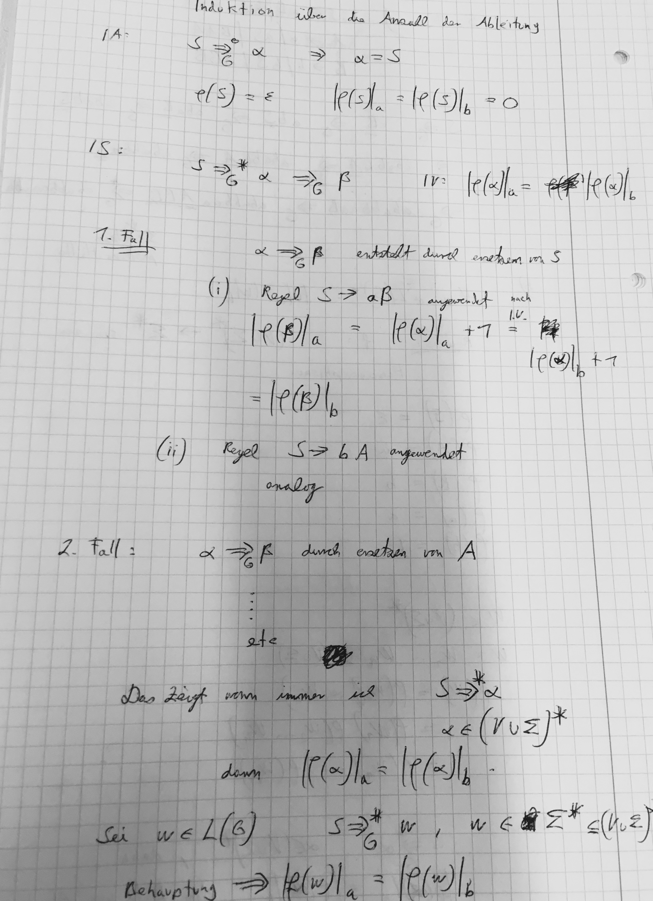
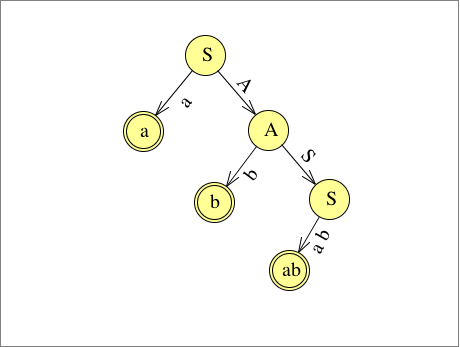
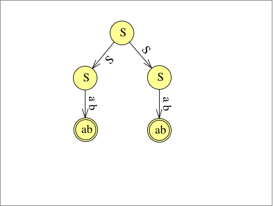

# Übungsblatt 06
## 1. Es sei M ein deterministischer endlicher Automat mit n Zuständen. Zeigen Sie: Wenn M ein Wort der Länge n akzeptiert, dann ist die von M akzeptierte Sprache unendlich.

---

## 2. Es sei $\Sigma$ ein Alphabet. Beweisen Sie, dass die Sprache der regulären Ausdrücke über $\Sigma$ nicht regulär ist.
*Hinweis: Reguläre Sprachen sind unter Homomorphismen abgeschlossen.*

---

## 3.
Def.:
Eine Grammatik $G=(V,\Sigma ,R,S)$ heißt rechtslinear, falls alle Regeln in $R$ von der Form $A\rightarrow \sigma B$ ($\sigma$: Terminal; B: Nichtterminal) oder $A\rightarrow \varepsilon$ sind mit $A,B\in V$ und $\sigma \in \Sigma$.

Eine Grammatik $G=(V,\Sigma ,R,S)$ heißt linkslinear, falls alle Regeln in R von der Form $A\rightarrow B\sigma$ oder $A\rightarrow \varepsilon$ sind mit $A,B\in V$ und $\sigma \in \Sigma$.

Eine Grammatik heißt regulär, wenn sie rechtslinear oder linkslinear ist.

V: endlichen Menge von Nonterminale
$\Sigma$: Alphabet
R: endliche Menge von Produktionsregeln
S: Startsymbol

__a) Geben Sie eine rechtslineare Grammatik an, die die Sprache $L(a^* bba^* )$ erzeugt.__
$G=(\{S,A,B\},\{a,b\},R,S)$
$R=\{S\rightarrow aS|bB, B\rightarrow bA, A\rightarrow aA|\varepsilon\}$
__b) Geben Sie eine reguläre Grammatik an, die die Menge aller Wörter $w\in \{a,b\}^* $, die höchstens zwei Vorkommen von a haben, erzeugt.__
$G=(\{S,A,B\},\{a,b\},R,S)$
$R=\{S\rightarrow bS|aB|\varepsilon, B\rightarrow bB|aA, A\rightarrow bB|\varepsilon\}$

---

## 4. Es seien $\Sigma =\{a,b\}$ ein Alphabet und $G=(\{S,A,B\},\Sigma , R, S)$ eine kontextfreie Grammatik mit der Regelmenge $R=\{S\rightarrow aB|bA,A\rightarrow a|aS|BAA, B\rightarrow b|bS|ABB\}$ gegeben.

Def.:
Eine Grammatik $G=(V,\Sigma,R,S)$ heißt kontextfrei, falls $R\subseteq V\times (V\cup \Sigma)^* $.
$\rightarrow$ Auf der linken Seite einer Regel steht also stets genau ein Nichtterminal.

Def.:
Eine Sprache $L$ heißt kontextfrei, falls es eine kontextfreie Grammatik $G$ gibt, so dass $L=L(G)$.

* a) Beweisen Sie, dass ababbaaabb zu $L(G)$ gehört.

| S | $\Rightarrow_G$ | aB |
| --- | --- | --- |
| | $\Rightarrow_G$ | aABB |
| | $\Rightarrow_G$ | aBAABB |
| | $\Rightarrow_G$ | abaBAABB |
| | $\Rightarrow_G$ | ababSAABB |
| | $\Rightarrow_G$ | ababbAAABB |
| | $\Rightarrow_G$ | ababbaaabb |

* b) Beweisen Sie, dass alle Wörter in $L(G)$ gleich viele a und b enthalten.
Hinweis: Es sei $SF(G)$ die Menge der erzeugten Satzformen der Grammatik G, definiert durch $SF(G)=\{w \in (V \cup \Sigma )^* |S\Rightarrow_G^* w\}$.
Beweisen Sie zunächst für alle Wörter $w$ in $SF(G)$ (durch vollständige Induktion über die Ableitungslänge), dass $|w|a + |w|A = |w|b + |w|B$ gilt.

Seien $\Sigma$ und $\Gamma$ Alphabete.
Eine Funktion $h:\Sigma^* \rightarrow \Gamma^* $ mit
$$h(uv)=h(u)h(v)$$
für alle $u,v\in \Sigma^* $ heißt Homomorphismus.

---

## 5. Beweisen Sie, dass die folgenden Sprachen kontextfrei sind, indem Sie jeweils eine kontextfreie Grammatik angeben, die die Sprache erzeugt.
* a) $L=\{a^nb^nc^m |n\geq 1, m\geq 3\}$
$G=(\{S,A,B,C\},\{a,b,c\},R,S)$
$R=\{S\rightarrow ABCCC,A\rightarrow aAb|a, B\rightarrow b, C\rightarrow c|cC\}$
* b) $L=\{a^mb^n |m\geq n\}$
$G=(\{S,A,B\},\{a,b\},R,S)$
$R=\{S\rightarrow AB|\varepsilon ,A\rightarrow aAB|aA|a ,B\rightarrow b\}$
* c) $L=\{w\in \{a,b\}^* | w=w^R\}$
$G=(\{S\},\{a,b\},R,S)$
$R=\{S\rightarrow aSa|bSb|\varepsilon |a|b \}$ (Palindrom)

## 6. Es sei $G = (\{S, A, B\}, \{a, b\}, R, S)$ eine kontextfreie Grammatik mit $R=\{S\rightarrow SS|aA|B|ab, A\rightarrow bS, B\rightarrow abS\}$ .

Def.:
Eine kontextfreie Grammatik G heißt eindeutig, falls es für jedes w ∈ L(G) genau einen Syntaxbaum gibt, sonst mehrdeutig.

* a) Beweisen Sie, dass $G$ mehrdeutig ist.
$w=abab$

* b) Geben Sie die von $G$ erzeugte Sprache $L(G)$ an.
$L=\{w\in \{a,b\}^* | w=\{ab\}^+\}$
* c) Geben Sie eine nicht-mehrdeutige Grammatik $G'$ an, die $L(G)$ erzeugt.
$G'=(\{S\},\{a,b\},\{S\rightarrow ab|abS\},S)$
