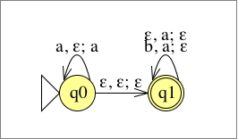

# Übungsblatt 07
## 1. Beweisen Sie, dass die folgenden Sprachen kontextfrei sind, indem Sie jeweils eine kontextfreie Grammatik angeben, die die Sprache erzeugt.
* __a) $L=\{aubw|u,w\in \{a,b\}^* , |u|=|w|\}$__
$G=(\{S,B\},\{a,b\}, R,S)$
$R=\{S \rightarrow aB, B \rightarrow b|aBa|bBb|aBb|bBa\}$
* __b) $L=\{x^R\#y|x,y\in \{0,1\}^* , \text{x ist Teilwort von y}\}$__
$G=(\{S,B\},\{0,1,\#\}, R,S)$
$R=\{S\rightarrow 0X0|1X1Y|X,X\rightarrow 0X0|1X1|\#Y,Y\rightarrow0Y|1Y|\varepsilon\}$

---

## 2. Es sei $G=(V,\Sigma , R,S)$ eine kontextfreie Grammatik. Im Beweis der Herstellung einer zu $G$ äquivalenten Grammatik $G'$ in Chomsky Normalform wird bei der Eliminierung der $\varepsilon$-Regeln die Menge $V_{\varepsilon}=\{A\in V|A\Rightarrow_G^* \varepsilon\}$ benutzt. Geben Sie einen Algorithmus an, der $V_{\varepsilon}$ bestimmt, und begründen Sie, dass er terminiert und korrekt ist.

Def.:
Eine kontextfreie Grammatik $G=(V,\Sigma , R,S)$ heißt in Chomsky Normalform, falls alle Produktionsregeln in R eine der folgenden Formen haben:
$S\rightarrow \varepsilon$
$A\rightarrow a$ für ein a aus $\Sigma$
$A\rightarrow BC$ für $B,C\in V-\{S\}$

---

## 3. Gegeben ist die kontextfreie Grammatik $G=(\{S,A,B,C\},\{a,b,c\},R,S)$ mit folgenden Regeln in R:

__$S\rightarrow ASA|ACA$
$A\rightarrow aAa|B|C$
$B\rightarrow bB|A|b$
$C\rightarrow cC|\varepsilon$__

__Konstruieren Sie – gemäß des in der Vorlesung angegebenen Algorithmus – eine zu $G$ äquivalente $G'$ in Chomsky-Normalform.__

1) Elimination des Startsymbols auf rechten Seiten
$G_1=(\{S',S,A,B,C\},\{a,b,c\},R_1,S')$
$S'\rightarrow ASA|ACA$
$S\rightarrow ASA|ACA$
$A\rightarrow aAa|B|C$
$B\rightarrow bB|A|b$
$C\rightarrow cC|\varepsilon$

2) Elimination von ε-Regeln
Allgemein: $V_{\varepsilon}=\{A\in V|A\Rightarrow_G^* \varepsilon\}$
$G_2=(\{S',S,A,B,C\},\{a,b,c\},R_2,S')$
$S'\rightarrow \varepsilon$
$S'\rightarrow ASA|ACA|AA|AS|SA|AC|CA|A|S|C$
$S\rightarrow ASA|ACA|AA|AS|SA|AC|CA|A|S|C$
$A\rightarrow aAa|B|C|aa$
$B\rightarrow bB|A|b$
$C\rightarrow cC|c$

3) Elimination von Kettenregelzyklen
Zyklen: $S\rightarrow S, A\rightarrow B\rightarrow A$
Ersetzen aller Vorkommen von S zu $S_1$ und alle Vorkommen von A und B durch $A_1$
$G_3=(\{S',S_1,A_1,C\},\{a,b,c\},R_3,S')$
$S'\rightarrow \varepsilon$
$S'\rightarrow A_1S_1A_1|A_1CA_1|A_1A_1|A_1S_1|S_1A_1|A_1C|CA_1|A_1|S_1|C$
$S_1\rightarrow A_1S_1A_1|A_1CA_1|A_1A_1|A_1S_1|S_1A_1|A_1C|CA_1|A_1|C$
$A_1\rightarrow aA_1a|C|aa$
$A_1\rightarrow bA_1|b$
$C\rightarrow cC|c$

4) Elimination von Kettenregeln
$G_3=(\{S',S_1,A_1,C\},\{a,b,c\},R_3,S')$
$S'\rightarrow \varepsilon$
$S'\rightarrow A_1S_1A_1|A_1CA_1|A_1A_1|A_1S_1|S_1A_1|A_1C|CA_1|A_1|S_1|C$
$S_1\rightarrow A_1S_1A_1|A_1CA_1|A_1A_1|A_1S_1|S_1A_1|A_1C|CA_1|A_1|C$
$A_1\rightarrow aA_1a|C|aa$
$A_1\rightarrow bA_1|b$
$C\rightarrow cC|c$

5) Elimination von nichtisolierten Terminalsymbolen auf rechten Seiten
$G_3=(\{S',S_1,A_1,C,T_a\},\{a,b,c\},R_3,S')$
$S'\rightarrow \varepsilon$
$S'\rightarrow A_1S_1A_1|A_1CA_1|A_1A_1|A_1S_1|S_1A_1|A_1C|CA_1|A_1|S_1|C$
$S_1\rightarrow A_1S_1A_1|A_1CA_1|A_1A_1|A_1S_1|S_1A_1|A_1C|CA_1|A_1|C$
$A_1\rightarrow T_aA_1T_a|C|T_aT_a$
$A_1\rightarrow bA_1|b$
$C\rightarrow cC|c$
$T_a\rightarrow a$

6) Elimination von langen rechten Seiten
$G_3=(\{S',S_1,A_1,C,T_a,D_1,D_2,D_3\},\{a,b,c\},R_3,S')$
$S'\rightarrow \varepsilon$
$S'\rightarrow A_1D_1|A_1D_2|A_1A_1|A_1S_1|S_1A_1|A_1C|CA_1|A_1|S_1|C$
$S_1\rightarrow A_1D_1|A_1D_2|A_1A_1|A_1S_1|S_1A_1|A_1C|CA_1|A_1|C$
$A_1\rightarrow T_aD_3|C|T_aT_a$
$A_1\rightarrow bA_1|b$
$C\rightarrow cC|c$
$T_a\rightarrow a$
$D_1\rightarrow S_1A_1$
$D_2\rightarrow CA_1$
$D_3\rightarrow A_1T_a$

---

## 4. Es sei $G=(\{S,A,B,C\},\{a,b\},R,S)$ mit $R=\{S\rightarrow AB|BC, A\rightarrow BA|a, B\rightarrow CC|b, C\rightarrow AB|a\}$ eine kontexfreie Grammatik in Chomsky Normalform. Bestimmen Sie mit Hilfe des in der Vorlesung angegebenen Algorithmus von Cocke, Younger und Kasami, ob das Wort baaba zu $L(G)$ gehört sowie welche Präfixe von baaba von $G$ erzeugt werden und welche nicht.

CYK-Algorithmus löst das Wortproblem für kontextfreie Spraachen, die durch eine kontextfreie Grammatik in Chomsky Normalform gegeben sind.

$w=baaba$

$\begin{matrix}
   &  1  &  2    &  3    &  4  &  5    \\
   &  b  &  a    &  a    &  b  &  a    \\
 1 & \{B\}&  .    &  .    &  .  &  .    \\
 2 &     & \{A,C\}&  .    &  .  &  .    \\
 3 &     &       & \{A,C\}&  .  &  .    \\
 4 &     &       &       & \{B\}&  .    \\
 5 &     &       &       &     & \{A,C\}\\
\end{matrix}$

$\Rightarrow \begin{matrix}
   &  1  &  2    &  3    &  4    &  5    \\
   &  b  &  a    &  a    &  b    &  a    \\
 1 & \{B\}& \{A,S\}&  .    &  .    &  .    \\
 2 &     & \{A,C\}& \{B\}  &  .    &  .    \\
 3 &     &       & \{A,C\}& \{S,C\}&  .    \\
 4 &     &       &       & \{B\}  & \{A,S\}\\
 5 &     &       &       &       & \{A,C\}\\
\end{matrix}$
$\Rightarrow \begin{matrix}
   &  1  &  2    &  3        &  4    &  5    \\
   &  b  &  a    &  a        &  b    &  a    \\
 1 & \{B\}& \{A,S\}& \emptyset &  .    &  .    \\
 2 &     & \{A,C\}& \{B\}      & \{B\}  &  .    \\
 3 &     &       & \{A,C\}    & \{S,C\}& \{B\}  \\
 4 &     &       &           & \{B\}  & \{A,S\}\\
 5 &     &       &           &       & \{A,C\}\\
\end{matrix}$
$\Rightarrow \begin{matrix}
   &  1  &  2    &  3        &  4        &  5      \\
   &  b  &  a    &  a        &  b        &  a      \\
 1 & \{B\}& \{A,S\}& \emptyset & \emptyset &  .      \\
 2 &     & \{A,C\}& \{B\}      & \{B\}      & \{S,A,C\}\\
 3 &     &       & \{A,C\}    & \{S,C\}    & \{B\}    \\
 4 &     &       &           & \{B\}      & \{A,S\}  \\
 5 &     &       &           &           & \{A,C\}  \\
\end{matrix}$
$\Rightarrow \begin{matrix}
   &  1  &  2    &  3        &  4        &  5      \\
   &  b  &  a    &  a        &  b        &  a      \\
 1 & \{B\}& \{A,S\}& \emptyset & \emptyset & \{S,A,C\}\\
 2 &     & \{A,C\}& \{B\}      & \{B\}      & \{S,A,C\}\\
 3 &     &       & \{A,C\}    & \{S,C\}    & \{B\}    \\
 4 &     &       &           & \{B\}      & \{A,S\}  \\
 5 &     &       &           &           & \{A,C\}  \\
\end{matrix}$

$S\in N[1,5] \rightarrow w \in L(G)$

**Welche Präfixe von baaba gehören zu L(G)?**
* überall wo S in der ersten Zeile Steht: nur ba

---

## 5. Geben Sie für die folgende Sprache einen Kellerautomaten an, der sie akzeptiert.
__$$L=\{a^mb^n \in \{a,b\}^* |m\geq n\geq 0\}$$__

Def.:
Ein Kellerautomat ist ein 6-Tupel $(K,\Sigma,\Gamma,\Delta,s,F)$, wobei gilt:
* $K$ ist eine endliche Menge von Zuständen,
* $\Sigma$ ist ein Alphabet, das Eingabealphabet,
* $\Gamma$ ist ein Alphabet, das Kelleralphabet,
* $s\in K$ ist der Startzustand,
* $\Delta \subseteq(K \times (\Sigma \cup \{\varepsilon\})\times \Gamma^* )\times(K\times\Gamma^* )$ ist die Übergangsrelation,
* $\Delta$ ist endlich und
* $F\subseteq K$ ist die Menge der Endzustände.

Ein Kellerautomat $M=(K,\Sigma,\Gamma,\Delta,s,F)$ akzeptiert ein Wort $w\in \Sigma^* $ genau dann wenn $(s,w,\varepsilon)\vdash_M^* (p,\varepsilon,\varepsilon)$ für ein $p \in F$.

