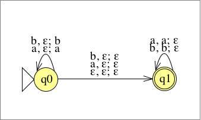
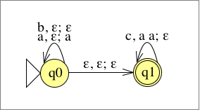
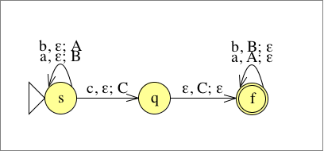
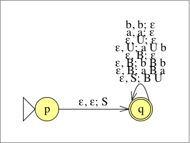
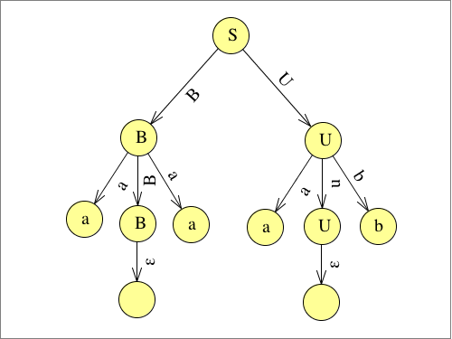

# Übungsblatt 08
## 1. Geben Sie für die Sprache $$L=\{w\in \{a,b\}^* |w=w^R\}$$ einen Kellerautomaten an, der sie akzeptiert.

---

## 2. Es sei die folgende Sprache gegeben. $$L=\{xc^n| x\in \{a,b\}^* ,|x|_ a=2n\}$$
* **a) Geben Sie einen Kellerautomaten M an, der L akzeptiert.**

* **b) Konstruieren Sie gemäß des in der Vorlesung angegebenen Algorithmus einen zu M äquivalenten Kellerautomaten in Normalform.**

Def.:
Ein Kellerautomat $M=(K,\Sigma,\Gamma,\Delta,s,F)$ ist in Normalform, falls gilt:
• Es gibt genau einen Endzustand f.
• Jeder Übergang legt entweder genau ein weiteres Symbol auf dem Keller ab oder er entfernt genau ein Symbol vom Keller, d.h., für alle Übergänge ((q,α,β),(p,ζ)) ∈ ∆ gilt entweder (|β|=1 und |ζ|=0) oder (|β|=0 und |ζ|=1).

Satz: [Chomsky und Evey]
Kellerautomaten und kontextfreie Sprachen
Die Klasse der kontextfreien Sprachen ist genau die Klasse der von Kellerautomaten akzeptierten Sprachen. Das heißt, dass Kellerautomaten und kontextfreie Grammatiken gleich ausdrucksmächtig sind.

Die Klasse der kontextfreien Sprachen ist abgeschlossen unter
a) Vereinigung,
b) Konkatenation und
c) Kleene Star.

$\Delta=\{((q_0,a,\varepsilon),(q_0,a)),((q_0,b,\varepsilon)),((q_0,\varepsilon,\varepsilon),(q_1,\varepsilon)),((q_1,c,aa),(q_1,\varepsilon))\}$

1. Allgemein:
$\Delta ''=\Delta \cup \{((f,\varepsilon,\varepsilon),(f',\varepsilon))\}$
$\Delta ''=\Delta \cup \{((q_1,\varepsilon,\varepsilon),(q_2,\varepsilon))\}$

2. $\{((q_1,c,aa),(q_1,\varepsilon))\} \Rightarrow \{((q_1,c,a),(q_{11},\varepsilon)),((q_{11},\varepsilon,a),(q_1,\varepsilon))\}$

3. $\Gamma'=\Gamma \cup \{\perp\}$
$((q_0,b,\varepsilon),(q_0,\varepsilon)) \Rightarrow ((q_0,b,\varepsilon),(q_{01},\perp)),((q_{01},\varepsilon,\perp),(q_0,\varepsilon))$
$((q_0,\varepsilon,\varepsilon),(q_1,\varepsilon))\Rightarrow ((q_0,\varepsilon,\varepsilon),(q_{02},\perp)),((q_{02},\varepsilon,\perp),(q_1,\varepsilon))$
$((q_1,\varepsilon,\varepsilon),(q_2,\varepsilon))\Rightarrow ((q_1,\varepsilon,\varepsilon),(q_{12},\perp)),((q_{12},\varepsilon,\perp),(q_2,\varepsilon))$

$$M'=\{K',\Sigma,\Gamma',\Delta',s,\{q_2\}\}$$
$K'=\{q_0,q_1,q_2,q_{01},q_{02},q_{11},q_{12}\}$
$\Sigma=\{a,b,c\}$
$\Gamma'=\{a,\perp\}$
$\Delta'=\{((q_0,a,\varepsilon),(q_0,a)),$
  $((q_0,b,\varepsilon),(q_{01},\perp)),((q_{01},\varepsilon,\perp),(q_0,\varepsilon)),((q_0,\varepsilon,\varepsilon),(q_{02},\perp)),$
  $((q_{02},\varepsilon,\perp),(q_1,\varepsilon)),((q_1,c,a),(q_{11},\varepsilon)),((q_{11},\varepsilon,a),(q_1,\varepsilon)),$
  $((q_1,\varepsilon,\varepsilon),(q_{12,},\perp)),((q_{12},\varepsilon,\perp),(q_2,\varepsilon))\}$

---

## 3. Es sei $M=(K,\Sigma,\Gamma,\Delta,s,F)$ ein Kellerautomat in Normalform mit $K = \{s,q,f\},\Sigma= \{a,b,c\},\Gamma = \{A,B,C\}, F = \{f\}$ und
$\Delta = \{$
  $((s,a,\varepsilon),(s,B)),$
  $((s, b,\varepsilon), (s, A)),$
  $((s, c,\varepsilon), (q, C)),$
  $((q,\varepsilon, C), (f,\varepsilon)),$
  $((f, a, A), (f,\varepsilon)),$
  $((f, b, B), (f,\varepsilon)) \}$.
* a) Geben Sie das Zustandsdiagramm für M an.

* b) Konstruieren Sie – dem aus der Vorlesung bekannten Algorithmus gemäß – die zu M äquivalente kontextfreie Grammatik G. Sie müssen hierbei die Regeln der Form $A_{pq}\rightarrow A_{pr}A_{rq}$ für alle $p, q, r\in K$ nicht explizit angeben.

Allgemein:
$((p,\sigma,\varepsilon),(r,\gamma)) \land ((t, \tau, \gamma),(q,\varepsilon))$
$A_{pq}\rightarrow \sigma A_{rt}\tau$
$A_{pq}\rightarrow A_{pr}A_{rq}$
$A_{pp}\rightarrow \varepsilon$

$((s,c,\varepsilon),(q,C))$
$((q,\varepsilon,C),(f,\varepsilon))$
$A_{sf}\rightarrow cA_{qq},A_{sf}\rightarrow A_{sq}A_{qf},A_{ss}\rightarrow \varepsilon$

$((s,b,\varepsilon),(a,A))$
$((f,a,A)(f,\varepsilon))$
$A_{sf}\rightarrow bA_{sf}a,A_{sf}\rightarrow A_{ss}A_{sf},A_{ss}\rightarrow \varepsilon$

$((s,a,\varepsilon),(s,B))$
$((f,b,B),(f,\varepsilon))$
$A_{sf}\rightarrow aA_{sf}b,A_{sf}\rightarrow A_{ss}A_{sf},A_{ss}\rightarrow \varepsilon$

$$G=(V,\Sigma,R,A_{sf})$$
$V=\{A_{sf},A_{qq},A_{sq},A_{qf},A_{ss}\}$
$\Sigma=\{a,b,c\}$
$R=\{A_{sf}\rightarrow cA_{qq},A_{sf}\rightarrow A_{sq}A_{qf},A_{ss}\rightarrow \varepsilon,$
$A_{sf}\rightarrow bA_{sf}a,A_{sf}\rightarrow A_{ss}A_{sf},A_{sf}\rightarrow aA_{sf}b\}$

* c) Geben Sie eine Ableitung für das Wort $abacbab$ bezüglich G an.

| $A_{sf}$ | $\Rightarrow_G$ | $aA_{sf}b$ |
| -------- | --------------- | ---------- |
|          | $\Rightarrow_G$ | $abA_{sf}ab$ |
|          | $\Rightarrow_G$ | $abaA_{sf}bab$ |
|          | $\Rightarrow_G$ | $abacA_{qq}bab$ |
|          | $\Rightarrow_G$ |

---

## 4. Sei $G=(V,\Sigma,R,S)$ eine kontextfreie Grammatik mit $\Sigma = \{a,b\}, V=\{S,B,U\}$ und $R=\{S\rightarrow BU, B\rightarrow aBa|bBb|\varepsilon, U\rightarrow aUb|\varepsilon \}$.
* a) Konstruieren Sie mit Hilfe des in der Vorlesung angegebenen Verfahrens einen Kellerautomaten M, der $L(G)$ akzeptiert.
Allgemein:
$\Delta=\{((p,\varepsilon,\varepsilon),(q,S)\}$
$\cup \{((q,\varepsilon,A),(q,x))|A\rightarrow x \text{ in } R\}$
$\cup \{((q,\sigma, \sigma ),(q,\varepsilon))| \sigma \in \Sigma$

* b) Geben Sie eine Linksableitung für $aaab$ an.

| S | $\Rightarrow_G^L$ | $BU$ |
| --- | --------------- | ---- |
|   | $\Rightarrow_G^L$ | $aBaU$ |
|   | $\Rightarrow_G^L$ | $aaU$ |
|   | $\Rightarrow_G^L$ | $aaaUb$ |
|   | $\Rightarrow_G^L$ | $aaab$ |

* c) Geben Sie einen Syntaxbaum für $aaab$ an.

* d) Geben Sie eine akzeptierende Berechnung des Kellerautomaten M für das Eingabewort $aaab$ an.

| Zustand | Wort | Stack |
| :-----: | :--: | :---: |
| $\vdash_M$(p       | aaab | $\varepsilon$)      |
| $\vdash_M$(q       | aaab | S)     |
| $\vdash_M$(q       | aaab | BU)    |
| $\vdash_M$(q       | aaab | U)     |
| $\vdash_M$(q       | aaab | aUb)   |
| $\vdash_M$(q       | aab  | Ub)    |
| $\vdash_M$(q       | aab  | aUbb)  |
| $\vdash_M$(q       | ab   | Ubb)   |
| $\vdash_M$(q       | ab   | aUbbb) |
| $\vdash_M$(q       | b    | Ubbb)  |
| $\vdash_M$(q       | b    | bbb)   |
| $\vdash_M$(q       | $\varepsilon$     | bb)    |
| $\vdash_M$(q       | $\varepsilon$     | b)     |
| $\vdash_M$(q       | $\varepsilon$     | $\varepsilon$ )     |

---

## 5. Beweisen Sie, dass die Sprache $$L=\{www|w\in \{a,b\}^* \}$$ nicht kontextfrei ist.
