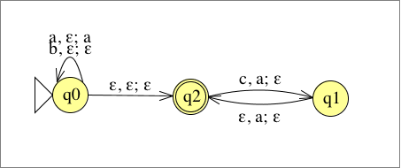

# Übungsblatt 08
## 1. Geben Sie für die Sprache $$L=\{w\in \{a,b\}^* |w=w^R\}$$ einen Kellerautomaten an, der sie akzeptiert.

---

## 2. Es sei die folgende Sprache gegeben. $$L=\{xc^n| x\in \{a,b\}^* ,|x|_ a=2n\}$$
* **a) Geben Sie einen Kellerautomaten M an, der L akzeptiert.**

* **b) Konstruieren Sie gemäß des in der Vorlesung angegebenen Algorithmus einen zu M äquivalenten Kellerautomaten in Normalform.**

---

## 3. Es sei $M=(K,\Sigma ,\Gamma ,\Delta ,s,F)$  ein Kellerautomat in Normalform mit $K=\{s,q,f\}$, $\Sigma = \{a,b\}$, $\Gamma = \{a,b,\bot\}$, $F=\{f\}$  und
$\Delta = \{((s,\varepsilon,\varepsilon),(q,\bot)),$
  $((q,a,\bot),(q,a\bot)),((q,a,a)(q,aa)),((q,a,b),(q,\varepsilon))$
  $,((q,b,\bot),(q,b\bot)),((q,b,b),(q,bb))$
  $,((q,b,a)(q,\varepsilon)),((q,\varepsilon,\bot),(f,\varepsilon))\}$.

* a) Welche Sprache wird von M akzeptiert?
* b) Geben Sie für das Wort $aababb$ eine akzeptierende Berechnung bezüglich M an.
* c) In der Vorlesung haben wir ein Konstruktionsverfahren kennengelernt, um eine zu M äquivalente kontextfreie Grammatik G zu erzeugen. Welche Produktionsregeln ergeben sich aus dem Übergang $((q,b,a),(q,\varepsilon))$, welche aus dem Übergang $((q, a, a), (q, aa))$?
* d) Geben Sie eine Ableitung für das Wort $aababb$ bezüglich G an. Dazu ist es notwendig, dass Sie aus weiteren Übergängen Produktionsregeln erzeugen. Allerdings brauchen Sie hier nur solche Produktionsregeln der Grammatik zu erzeugen, die Sie für die Ableitung benötigen.

---

## 4. Sei $G=(V,\Sigma,R,S)$ eine kontextfreie Grammatik mit $\Sigma = \{a,b\}, V=\{S,B,U\}$ und $R=\{S\rightarrow BU, B\rightarrow aBa|bBb|\varepsilon, U\rightarrow aUb|\varepsilon \}$.
* a) Konstruieren Sie mit Hilfe des in der Vorlesung angegebenen Verfahrens einen Kellerautomaten M, der $L(G)$ akzeptiert.
* b) Geben Sie eine Linksableitung für $aaab$ an.
* c) Geben Sie einen Syntaxbaum für $aaab$ an.
* d) Geben Sie eine akzeptierende Berechnung des Kellerautomaten M für das Eingabewort $aaab$ an.

---

## 5. Beweisen Sie, dass die Sprache $$L=\{www|w\in \{a,b\}^* \}$$ nicht kontextfrei ist.
