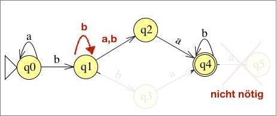

# Übung 5

## Aufgabe 1:
**Sei $\Sigma = \{a,b\}$. Geben Sie reguläre Ausdrücke für die folgenden Sprachen an. Sie dürfen dabei wie
in der Vorlesung angegeben Klammern einsparen.**
* (a) $\{w \in \Sigma^* | w \text{ enthaelt geradzahlig viele a}\}$

 $(b^* a b^* a b^* ) b^* $
* (b) $\{w \in \Sigma^* | \text{ in w gibt es genau ein Vorkommen des Teilwortes aaa}\}$

 $b^* ((aa \cup a)bb^* )^* aaa (bb^* (aa \cup a) )^* b^* $

---
## Aufgabe 2:
**Geben Sie einen (nichtdeterministischen) endlichen Automaten, der die Sprache $L(a^*bb^*(a \cup b)ab^*)$ akzeptiert. Zustandsübergangsdiagramm genügt. Dabei ist es hilfreich, dem die Abschlusseigenschaften regulärer Sprachen ausnutzenden Beweis aus der Vorlesung zu folgen, Sie müssen dies aber nicht tun.**

Korrektur: $q_1 \rightarrow q_1$ mit b, $q_5$ kann weg

---
## Aufgabe 3:
**Beweisen oder widerlegen Sie: $\{www | w \in \{a,b\}^*\}$ ist eine reguläre Sprache.**

Annahme: $L=\{www | w \ in \{a,b\}^* \} \in REG$

Dann gäbe es laut PL für reguläre Sprachen eine Zahl $n \in N$, so dann sich alle Wörter $w \in L$ mit $|w| \geq n$ in $w=xyz$ zerlegen lassen würden, wobei

* 1) $|xy| \leq n$
* 2) $y \neq \varepsilon$
* 3) $\forall i \geq 0: xy^iz \in L$

Wir betrachten nun für gegebenes n das Wort $w=a^nba^nba^nb \in L$

Da $|w|=3n \geq n$, lässt sich w wie oben zerlegen.

* (1) $|w|$ ist höchstens $a^n$
* (2) $|y|_ a \geq 1$
* (3) $x=a^k$   $y=a^l | k+l \leq n$

---
## Aufgabe 4:
**Beweisen oder widerlegen Sie: $\{xyx^R | x,y \in \{a,b\}^*\}$ ist eine reguläre Sprache.**

Sprache ist regulär.

$\{xyx^R | x,y \in \{a,b\}^* \}$ ist die Langform von $L=\{a,b\}^* $, da

$L \subseteq \Sigma^* $

$L = \{xyx^R | x,y \in \Sigma^* \} \supseteq^{x=\epsilon}  \{\epsilon y \epsilon^R | y \in \Sigma^* \} = \{ y: y \in \Sigma^* \} = \Sigma^* $

$\Sigma^* \subseteq L \subseteq \Sigma^* => L = \Sigma^*$
daher regulär und in einem Automaten abbildbar:

---
## Aufgabe 5:
**Welche der folgenden Aussagen sind wahr, welche falsch? Begründen Sie jeweils ihre Antwort!**
* (a) **Jede Teilmenge einer regulären Sprache ist eine reguläre Sprache.**

 Falsch, $L= \Sigma ^* = L(a^* ,b^* ) \rightarrow L=\{w|w\in \{a,b\}^* \}$

 $L_1=\{a,b\}^* $ reguläre Sprache (sh. Aufgabe 4)

 $L_2=\{a^nb^n | n \geq 0\}$ nicht regulär

 aber  $L_2 \subset L_1$ q.e.d.

* (b) **Falls L eine reguläre Sprache ist, so ist die Sprache $L^R=\{w^R | w \in L\}$ ebenfalls regulär.**

 Wahr, Automat von L kann in $L^R$ umgewandelt werden(Anfangszustand = Endzustand , Endzustand = Anfangszustand, Pfeile umkehren für NEA)
 $L=L(M) \Rightarrow \exists M' : L^R=L(M')$

* (c) **Für jede reguläre Sprache L gibt es einen NEA mit genau einem Endzustand.**

 Wahr, im NEA werden alle Endzustände zu einem unter Eingabe von Epsilon zu einem Eindzustand geführt.
* (d) **Falls $L \subseteq \Sigma^*$ regulär ist, dann ist auch $\{w | w \in L \land w \in L^R\}$ regulär.**

 Wahr,
 $\{w | w \in L \land w \in L^R\}$
 $L \in REG \Rightarrow L^R \in REG \Rightarrow L \cap L^R \in REG$
---
## Aufgabe 6:
**Geben Sie eine rechtslineare Grammatik an, die die Sprache $L(a^*bba^*)$ erzeugt.**

$G=(\{S,B,C\},\{a,b\},\{S \rightarrow aS| B, B \rightarrow bC, C \rightarrow bA, A \rightarrow A|aA|\epsilon \}, S)$

---
## Aufgabe 7:
**Sei $\Sigma = \{a,b\}$ und sei $G=(V, \Sigma , R, S)$ eine kontextfreie Grammatik, wobei $V=\{S,A,B\}$ und
$R=\{S \rightarrow aB | bA, A \rightarrow a | aS | BAA, B \rightarrow b | bS | ABB\}$.**
* (a) **Zeigen Sie, dass ababbaaabb zu L(G) gehört.**
 $S \Rightarrow_G aB \Rightarrow_G abS \Rightarrow_G abaB \Rightarrow_G ababS$

 $\Rightarrow_G ababbA \Rightarrow_G ababbaS \Rightarrow_G ababbaaB$

 $\Rightarrow_G ababbaaABB \Rightarrow_G ababbaaabb$
* (b) **Zeigen Sie, dass alle Wörter in L(G) gleichviele a und b enthalten.**

 Die Aussage ist richtig, kann es aber nicht vollständig beweisen.
 
 Brauche noch den Beweis von:

 $|ABB|_ b=|ABB|_ a-1$ und  $|BAA|_ a = |BAA|_ b-1$

---
## Aufgabe 8:
**Geben Sie eine kontextfreie Grammatik an, die die Sprache $\{aubw | u,w \in \{a,b\} , |u|=|w|\}$ erzeugt.**

$R=\{S \rightarrow aB, B \rightarrow b|aBa|bBb|aBb|bBa\}$

$V=\{S,B\}$

$\Sigma = \{a,b\}$
