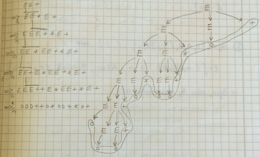
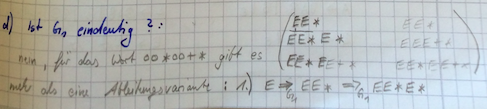

# Übung 6
## Aufgabe 1:
**Die kontextfreie Grammatik $G_1 = (V,\Sigma,R,E)$ mit $V = \{E\}$, $\Sigma = \{o, +, \times \}$ und $R = \{E \rightarrow E E + | E E \times | o\}$
erzeugt arithmetische Ausdrücke in Umgekehrter Polnischer Notation.**

(a) **Geben Sie eine Ableitung für das Wort o o o++ an.**

$E \Rightarrow_{G_1} EE+ \Rightarrow_{G_1} EEE++ \Rightarrow_{G_1} oEE++$

$\Rightarrow_{G_1} ooE++ \Rightarrow_{G_1} ooo++$

(b) **Geben Sie einen Syntaxbaum für das Wort o o o++o∗o o+∗o+ an.**

(c) **Gehört das Wort o o o o o o o+++∗∗ zu L(G1)?**

(d) **Ist die Grammatik G1 eindeutig? Begründen Sie ihre Antwort.**

---
## Aufgabe 2:
**Geben Sie eine kontextfreie Grammatik an, die die Sprache $\{a^ib^jc^kd^l$ | $i = j$ und $k = l$} erzeugt.**
**Geben Sie eine kontextfreie Grammatik an, die die Sprache $\{a^ib^jc^kd^l$ | $i = j$ und $k = l$} erzeugt.**

 $G=(\{S,A,B \}, \{a,b,c,d\}, \{S -> AB, A -> aAb|\epsilon, B -> cBd|\epsilon\},S)$

 $R=\{S \rightarrow ATBCUD | ATB | CUD , T \rightarrow \varepsilon | ATB, U \rightarrow \varepsilon | CUD,$

  $A\rightarrow a, B\rightarrow b, C\rightarrow c, D\rightarrow d\}$

---
## Aufgabe 3:
**Sei $G_3 = (\{S,A,B,T\},{a,c},R,S)$ mit $R=\{S \rightarrow AB|BA, A \rightarrow aA|ac, B \rightarrow Tc, T \rightarrow  aT |a\}$**

**Zeigen Sie, dass $G_3$ mehrdeutig ist.**

Das Wort acac lässt sich durch mindestens 2 Ableitungen bilden:
1. $S \Rightarrow_{G_3} AB \Rightarrow_{G_3} ATc \Rightarrow_{G_3} acTc \Rightarrow_{G_3} acac$
2. $S \Rightarrow_{G_3} BA \Rightarrow_{G_3} Bac \Rightarrow_{G_3} Tcac \Rightarrow_{G_3} acac$

---

* Weg 1:

$S \rightarrow_{G3} AB \rightarrow_{G3} ATc \rightarrow_{G3} AcTc \rightarrow_{G3} acac$

* Weg 2:

$S \rightarrow_{G3} BA \rightarrow_{G3} TcA \rightarrow_{G3} Tcac \rightarrow_{G3} acac$

---
## Aufgabe 4:
**Konstruieren Sie mit dem Verfahren aus der Vorlesung zur Grammatik G4 = ({A, B, S}, {a, b}, R, S) mit R = {S → aaA, A → BAB | B | ε, B → bb | ε} eine äquivalente Grammatik G in Chomsky Normalform.**

* Gegeben:
 *  $S \rightarrow aaA$
 * $A \rightarrow BAB | B | \varepsilon$
 * $B \rightarrow bb | \varepsilon$

* Elimination von $\varepsilon$-Regeln:
 * $S \rightarrow aaA | aa$
 * $A \rightarrow BAB | B | BB | BA | AB$
 * $B \rightarrow bb | b$

* Elimination von Kettenregeln
 * $S \rightarrow aaA | aa$
 * $A \rightarrow bbAbb | bb | bbbb | bbA | bA | Ab | bAbb$
 * $B \rightarrow bb | b$

* Elimination nichtisolirter Terminalsymbole
 * $S \rightarrow T_aT_aA | T_aT_a$
 * $A \rightarrow T_bT_bAT_bT_b |T_bT_b|T_bT_bT_bT_b|T_bT_bA|AT_bT_b|T_bAT_b| b| T_bA|AT_b | T_bAT_bT_b| T_bT_bAT_b|T_bT_bT_b$
 * $B \rightarrow T_bT_b|b$
 * $T_a \rightarrow a$
 * $T_b \rightarrow b$

* Elimination langer rechter Seiten
 * $S \rightarrow S_1A | S_1$
 * $A \rightarrow S_2T_bT_b | S_3 | S_3S_3 | S_2 | S_4 | T_bS_5 | b | T_bA | S_5 | T_bS_4 | S_2T_b | S_3T_b$
 * $B \rightarrow S_3 | b$
 * $S_1 \rightarrow T_aT_a$
 * $S_2 \rightarrow T_bT_bA$
 * $S_3 \rightarrow T_bT_b$
 * $S_4 \rightarrow AT_bT_b$
 * $S_5 \rightarrow A T_b$
 * $T_a \rightarrow a$
 * $T_b \rightarrow b$

---
## Aufgabe 5:
**Geben Sie für die Sprache $\{w \in \{a,b\}^* | w \text{hat ungerade Laenge und das mittlere Symbol ist ein a} \}$
einen Kellerautomaten an, der die Sprache akzeptiert.**

---
## Aufgabe 6:
**Sei M der durch das folgende Diagramm gegebene Kellerautomat.**

(a) **Geben Sie eine akzeptierende Berechnung für das Wort baabbabb an.**

| $((s,a,b),(s,\varepsilon))$ | s | baabbabb | $\varepsilon$ |
| $((s,a,\varepsilon),(s,a))$ | s |  aabbabb |       b       |
| $((s,b,a),(s,\varepsilon))$ | p |   abbabb |       a       |
| $((s,b,\varepsilon),(s,b))$ | p |   abbabb |       a       |
| $((s,a,b),(p,\varepsilon))$ | p |     babb |      aa       |
| $((s,a,\varepsilon),(p,a))$ | s |     babb |     aaa       |
| $((p,\varepsilon,\varepsilon),(s,a))$ | s |      abb |      aa       |
| $((p,\varepsilon, b),(s,\varepsilon))$ | s |       bb |     baa       |
|    |                      | s |        b |      aa       |
|     |                      | s | $\varepsilon$ |  a       |

## Aufgabe 6:
**Sei M der durch das folgende Diagramm gegebene Kellerautomat.**
a/b/ε
a/ε/a
b/a/ε
b/ε/b
ε/b/ε
sp
a/b/ε a/ε/a

(a) **Geben Sie eine akzeptierende Berechnung für das Wort baabbabb an. **

(b) **Welches ist die von M akzeptierte Sprache L(M)?**

ungerade Anzahl an as und bs
