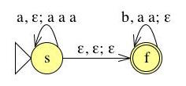
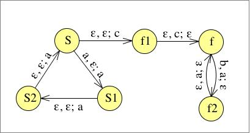
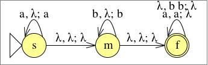

# Übung 7
## Aufgabe 1:
**Sei $\Sigma = \{0,1,\#\}$. Geben Sie eine kontextfreie Grammatik an, die die Sprache
$$\{x^R\#y | x,y \in \{0,1\}^*, x \text{ ist ein Teilwort von y}\}$$
erzeugt.**

$G=\{\{S,A,B\},\{0,1,\#\},\{S\rightarrow AB, A\rightarrow 0A0|1A1|\#B, B\rightarrow 0B|1B|\varepsilon\}, S\}$

Varianten:

$G=\{\{S,A,B\},\{0,1,\#\},\{S \rightarrow S0|S1|0S0|1S1|\#\}, S\}$

$G=\{\{S,A,B\},\{0,1,\#\},\{S\rightarrow S0|S1|X, X\rightarrow 0X0|1X1|Y, Y\rightarrow Y0|Y1|\#\}, S\}$

---
## Aufgabe 2:
**Geben Sie für die Sprache $\{xc^n | x \in \{a,b\}^* \text{ und die Anzahl der Vorkommen von a in x ist n}\}$ einen Kellerautomaten an, der die Sprache akzeptiert.**

q1 ist Endzustand

---
## Aufgabe 3:
**Sei $M=(K,\Sigma,\Gamma,\Delta,s,F)$ ein Kellerautomat mit $K=\{s,f\}, \Sigma = \Gamma = \{a,b\},F=\{f\}$ und
$$\Delta = \{((s,a,\varepsilon),(s,aaa)),((s,\varepsilon,\varepsilon),(f,\varepsilon)),((f,b,aa),(f,\varepsilon))\}$$**

a) **Welche Sprache wird von M akzeptiert?**

$\{ w \in \{a,b\}^* | 2*|w|_ a = 3*|w|_ b\}$

b) **Transformieren Sie M in einen äquivalenten Kellerautomaten M′ in Normalform.**
*Übergange zu dreifach a trennen in einzelne Übergänge*

---
## Aufgabe 4:
**Sei $M=(K,\Sigma,\Gamma,\Delta,s,F)$ der durch nebenstehendes Zustandsübergangsdiagramm gegebene Kellerautomat. M ist in Normalform. In der Vorlesung haben wir ein Konstruktionsverfahren kennengelernt, um eine kontextfreie Grammatik G zu erzeugen, so dass $L(G)=L(M)$. Geben Sie eine Ableitung für das Wort $aababb \in L(G)$ an. Sie brauchen hier nur jene Produktionsregeln der Grammatik zu erzeugen, die Sie für die Ableitung benötigen.**

$\Delta=\{((s,a,b),(s,\varepsilon)),((s,a,\varepsilon),(s,a)),((s,b,a),(s,\varepsilon)),((s,b,\varepsilon),(s,b))\}$

$A_{pq}\Rightarrow^* w' \Leftrightarrow (p,w,\varepsilon)\vdash^* (q,\varepsilon,\varepsilon)$

$A_{ss}\rightarrow aA_{ss}b | A_{ss}A_{ss} | \varepsilon | bA_{ss}a$

Ableitung von aababb:

| $A_{ss}$ | $\Rightarrow aA_{ss}b$ |
| -------- | ---------------------- |
|          | $\Rightarrow aaA_{ss}bb$ |
|          | $\Rightarrow aabA_{ss}abb$ |
|          | $\Rightarrow aababb$ |

---
## Aufgabe 5:
**Sei $G=(V,\Sigma,R,S)$ eine kontextfreie Grammatik mit $\Sigma = \{a, b\}, V = \{S, B, U \}$ und $R = {S \rightarrow BU, B \rightarrow aBa | bBb | \varepsilon, U \rightarrow aUb | \varepsilon}$**

a) **Konstruieren Sie mit Hilfe des in der Vorlesung angegeben Verfahrens einen Kellerautomaten M, der L(G) akzeptiert.**

b) **Geben Sie einen Syntaxbaum für aaab an.**

c) **Geben Sie eine Linksableitung für aaab an.**

| Regel                      | Ableitung |
|  ------------------------  |  -------  |
|                            | S         |
| $S\rightarrow BU$          | $\Rightarrow BU$ |
| $B\rightarrow aBa$         | $\Rightarrow aBaU$ |
| $B\rightarrow \varepsilon$ | $\Rightarrow aaU$ |
| $U\rightarrow aUb$         | $\Rightarrow aaaUb$ |
| $U\rightarrow \varepsilon$ | $\Rightarrow aaab$ |

d) **Geben Sie eine akzeptierende Berechnung des Kellerautomaten M für das Eingabewort aaab an.**

| $(p,aaab,\varepsilon)$ | $\vdash_M (q,aaab,S)$ |
| ---------------------- | -------------------- |
|                        | $\vdash_M (q,aaab,BU)$ |
|                        | $\vdash_M (q,aaab,aBaU)$ |
|                        | $\vdash_M (q,aab,BaU)$ |
|                        | $\vdash_M (q,aab,aU)$ |
|                        | $\vdash_M (q,ab,U)$ |
|                        | $\vdash_M (q,ab,aUb)$ |
|                        | $\vdash_M (q,b,Ub)$ |
|                        | $\vdash_M (q,b,b)$ |
|                        | $\vdash_M (q,\varepsilon,\varepsilon)$ |

---
## Aufgabe 6:
**Beweisen oder widerlegen Sie:
Die Sprache $\{a^nb^ma^n | n,m \leq 0 \text{ und m ist gerade} \} = \{a^nb^ma^n | n,m \leq 0\} \cap L(a^* (bb)^* a^*)$ ist kontextfrei.**

---
## Aufgabe 7:
**Beweisen oder widerlegen Sie: Die Sprache $L=\{a^{3k}ba^{2k}ba^k | k \leq 0\}$ ist kontextfrei.**

Widerlegen mit Pumping Lemma:

Beweis: Angenommen $L \in CF$. Dann existriert eine Konstante $h \geq 1$ wie im Punkpunt Lemma. Wähle $z=a^{3n}ba^{2n}ba^n \in L$ und es gilt $|z| = 6n+2 \Rightarrow |z| \geq n$

Also existiert $u,v,w,x,y \in \Sigma^*$, sodass $z=uvwxy, vx \neq \epsilon, |vwx| < n$

$z = a^{3n}ba^{2b}ba^n$

1. $vwx$ liegt ersten a-Block.

  $vx = a^l, l\geq 1$

  wähle $i=0: uv^0wx^0y=a^{3n-l}ba^{2n}ba^{n} \notin L$ Wdspr.

2. $vwx$ liegt ganz im zweiten a-Block.

  also in a^{3n}ba^2nba^n: analog zu 1.

3. $vwx$ liegt im letzten a-Block (analog zu 1.)
