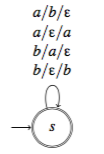

# Übung 7
## Aufgabe 1:
**Sei $\Sigma = \{0,1,\#\}$. Geben Sie eine kontextfreie Grammatik an, die die Sprache
$$\{x^R\#y | x,y \in \{0,1\}^*, x \text{ ist ein Teilwort von y}\}$$
erzeugt.**

$G=\{\{S,A,B\},\{0,1,\#\},\{S\rightarrow AB, A\rightarrow 0B0|1B1|\#A, B\rightarrow OA|1A|\varepsilon\}, S\}$

---
## Aufgabe 2:
**Geben Sie für die Sprache $\{xc^n | x \in \{a,b\}^* \text{ und die Anzahl der Vorkommen von a in x ist n}\}$ einen Kellerautomaten an, der die Sprache akzeptiert.**

---
## Aufgabe 3:
**Sei $M=(K,\Sigma,\Gamma,\Delta,s,F)$ ein Kellerautomat mit $K=\{s,f\}, \Sigma = \Gamma = \{a,b\},F=\{f\}$ und
$$\Delta = \{((s,a,\varepsilon),(s,aaa)),((s,\varepsilon,\varepsilon),(f,\varepsilon)),((f,b,aa),(f,\varepsilon))\}$$**

a) **Welche Sprache wird von M akzeptiert?**

$\{ w \in \{a,b\}^* | 2*|w|_a = 3*|w|_b\}$

b) **Transformieren Sie M in einen äquivalenten Kellerautomaten M′ in Normalform.**

## Aufgabe 4:
**Sei $M=(K,\Sigma,\Gamma,\Delta,s,F)$ der durch nebenstehendes Zustandsübergangsdiagramm gegebene Kellerautomat. M ist in Normalform. In der Vorlesung haben wir ein Konstruktionsverfahren kennengelernt, um eine kontextfreie Grammatik G zu erzeugen, so dass $L(G)=L(M)$. Geben Sie eine Ableitung für das Wort $aababb \in L(G)$ an. Sie brauchen hier nur jene Produktionsregeln der Grammatik zu erzeugen, die Sie für die Ableitung benötigen.**

---
## Aufgabe 5:
**Sei $G=(V,\Sigma,R,S)$ eine kontextfreie Grammatik mit $\Sigma = \{a, b\}, V = \{S, B, U \}$ und $R = {S \rightarrow BU, B \rightarrow aBa | bBb | \varepsilon, U \rightarrow aUb | \varepsilon}$**
a) **Konstruieren Sie mit Hilfe des in der Vorlesung angegeben Verfahrens einen Kellerautomaten M, der L(G) akzeptiert.**
b) **Geben Sie einen Syntaxbaum für aaab an.**
c) **Geben Sie eine Linksableitung für aaab an.**
d) **Geben Sie eine akzeptierende Berechnung des Kellerautomaten M für das Eingabewort aaab an.**

---
## Aufgabe 6:
**Beweisen oder widerlegen Sie:
Die Sprache $\{a^nb^ma^n | n,m \leq 0 \text{ und m ist gerade} \} = \{a^nb^ma^n | n,m \leq 0\} \cap L(a^* (bb)^* a^*)$ ist kontextfrei.**

---
## Aufgabe 7:
**Beweisen oder widerlegen Sie: Die Sprache $L=\{a^{3k}ba^{2k}ba^k | k \leq 0\}$ ist kontextfrei.**
