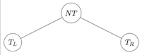
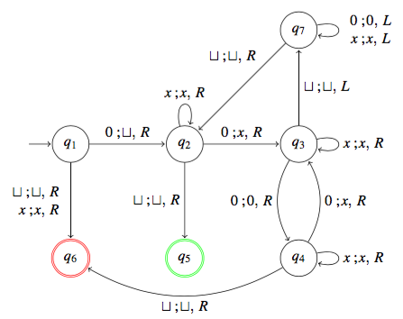

# Übung 8
## Aufgabe 1:
**Ist die Sprache $L = \{xy | x,y \in \{a,b\}^* \text{ und }|x| = |y|\}$ kontextfrei? Begründen Sie ihre Antwort!**

---
## Aufgabe 2:
**Ist die Sprache $L=\{a^ib^jc^k | 0 \leq i \leq j \leq k \}$  kontextfrei? Begründen Sie ihre Antwort!**

1) $\forall L \in CF$ (in Kontextfreie Spachen)

2) $\exists n \geq 1$

3) $\forall z \in L$, $|z| \geq n$

4) $\exists uvwxy \in \Sigma^*, (v*x) \neq \epsilon, |vwx|<n, z = uvwx$

5) $\forall i \geq 0: uv^iwx^iy \in L$

**Ang.:**

L wäre kontextfrei, dann existiern eine Zahl $n$ eine in PL. Wir wählen $z = a^n b^n c^n$ $z \in L$  und $|z|=3n \geq n.$

Nach dem PL existieren $u,v,w,x,y, \in \Sigma^*$, z=uvwxy mit $|vwx|<n$ und $vx \neq \epsilon$

**1.Fall**

$vwx$ liegt irgendwo in Präfix $a^nb^n$ von $z$ $$u=a^{n-i}$$
$$vwx=a^jb^k \text{ ; } j, k \geq 0; j+k <n; j+k \geq 1$$
$$y=b^{n-k}c^n$$

---

Lösung 1:

**2.Fall**

$vwx$ enthält $c$'s. Dann liegen die c's am Ende von $vwx$. Wenn $x \neq \epsilon$, dann enthält $x$ ein $c$. Aber da $|vwx|<n$ enthält $v$ kein $a$. Wähle $i=0:$

$uv^0wx^0y$ enthält mehr a's als c's
$$ \Rightarrow Widerspruch$$

sonst war $x=\epsilon$, dann muss aber $v \neq \epsilon$. Wieder enthält vwx keine a's. Wähle wieder $i=0$:
$uv^0wx^0y$ enthält mehr a's als b's oder c's
$$ \Rightarrow Beides Widerspruch$$

$$\Rightarrow \text{L nicht kontextfrei}$$

qed.

---
Diese alternative Lösung 2 braucht mehr Zeit:

Daher wissen wir, dass $v=a^{j_1}b^{k_1}$, $x=a^{j_2}b^{k_2}$
$$j_1+k_1+j_2+k_2 \geq 1$$

Wähle i = 2:
$$uv^iwx^iy = a^{n-j}a^{j_1}b^{k_1}a^{j_1}b^{k_1}wa^{j_2}b^{k_2}a^{j_2}b^{k_2}b^{n-k}c^n$$

Da nach Annahme $uv^2wx^2y \in L$, dürfen a's und b's nicht abwechseln:
$$k_1 \geq 1 \Rightarrow i_1 = 0 \land j_2 = 0$$
$$j_2 \geq 2 \Rightarrow k_1 = 0 \land k_2 = 0$$

$$... usw. $$

---
## Aufgabe 3:
**Sei G eine kontextfreie Grammatik in Chomsky Normalform. Zeigen Sie, dass jeder Syntaxbaum für ein Wort der Länge n aus L(G) genau $2n-1$ Knoten besitzt, die mit Nichtterminalen beschriftet sind.**

NT-Knoten = Nichtterminale Knoten

Blatt = Terminale = n

**Beweis durch strukturelle Induktion**
n= 1 w= \sigma \in \epsilon

S
|
\sigma

Anzahl der Knoten soll 2n-1 sein
 * I.Anfang:
  für alle Wörter der Länger \leq n-1 gelte die Aussage bereits:

  für n=1: 1 Blatt $\Rightarrow$ 1 NT-Knoten

 * I.Schritt: n>1 Blätter

 
 $T_L$ hat k Blätter;
 $T_R$ hat n-k Blätter

 * I.V.:
 Sei w der Länge n gegeben

  S

 /\

 Teilbäume A B aushängen

 $T_L$ hat $2k-1$ Knoten

 $T_R$ hat $2(n-k)-1$ Knoten

 $\Rightarrow |NT|=|T_L|+|T_R|+Root =(2k-1) + (2(n-k)-1) +1 = 2n-1$

---
## Aufgabe 4:
**Sei $G=(\{S,A,B,C\},\{a,b\},R,S)$ mit**
$$R=\{S \rightarrow AB | BC, A \rightarrow BA | a, B \rightarrow CC | b, C \rightarrow AB | a\}$$

**eine kontextfreie Grammatik in Chomsky Normalform. Überprüfen Sie mit Hilfe des CYK-Algorithmus, ob baaba zu L(G) gehört. Welche Präfixe von baaba gehören zu L(G)?**

w=baaba

$\begin{matrix}
   &  1  &  2    &  3    &  4  &  5    \\
   &  b  &  a    &  a    &  b  &  a    \\
 1 & \{B\\}&  .    &  .    &  .  &  .    \\
 2 &     & \{A,C\\}&  .    &  .  &  .    \\
 3 &     &       & \{A,C\}&  .  &  .    \\
 4 &     &       &       & \{B\}&  .    \\
 5 &     &       &       &     & \{A,C\}\\
\end{matrix}$
$\Rightarrow \begin{matrix}
   &  1  &  2    &  3    &  4    &  5    \\
   &  b  &  a    &  a    &  b    &  a    \\
 1 & \{B\}& \{A,S\}&  .    &  .    &  .    \\
 2 &     & \{A,C\}& \{B\}  &  .    &  .    \\
 3 &     &       & \{A,C\}& \{S,C\}&  .    \\
 4 &     &       &       & \{B\}  & \{A,S\}\\
 5 &     &       &       &       & \{A,C\}\\
\end{matrix}$
$\Rightarrow \begin{matrix}
   &  1  &  2    &  3        &  4    &  5    \\
   &  b  &  a    &  a        &  b    &  a    \\
 1 & \{B\}& \{A,S\}& \emptyset &  .    &  .    \\
 2 &     & \{A,C\}& \{B\}      & \{B\}  &  .    \\
 3 &     &       & \{A,C\}    & \{S,C\}& \{B\}  \\
 4 &     &       &           & \{B\}  & \{A,S\}\\
 5 &     &       &           &       & \{A,C\}\\
\end{matrix}$
$\Rightarrow \begin{matrix}
   &  1  &  2    &  3        &  4        &  5      \\
   &  b  &  a    &  a        &  b        &  a      \\
 1 & \{B\}& \{A,S\}& \emptyset & \emptyset &  .      \\
 2 &     & \{A,C\}& \{B\}      & \{B\}      & \{S,A,C\}\\
 3 &     &       & \{A,C\}    & \{S,C\}    & \{B\}    \\
 4 &     &       &           & \{B\}      & \{A,S\}  \\
 5 &     &       &           &           & \{A,C\}  \\
\end{matrix}$
$\Rightarrow \begin{matrix}
   &  1  &  2    &  3        &  4        &  5      \\
   &  b  &  a    &  a        &  b        &  a      \\
 1 & \{B\}& \{A,S\}& \emptyset & \emptyset & \{S,A,C\}\\
 2 &     & \{A,C\}& \{B\}      & \{B\}      & \{S,A,C\}\\
 3 &     &       & \{A,C\}    & \{S,C\}    & \{B\}    \\
 4 &     &       &           & \{B\}      & \{A,S\}  \\
 5 &     &       &           &           & \{A,C\}  \\
\end{matrix}$

|   |  1  |  2    |  3        |  4        |  5     |
| :--- | :---: | :---: | :---: | :---: | :---: |
|   |  b  |  a    |  a        |  b        |  a     |
| |
| 1 | {B} | {A,S} | $\emptyset$ | $\emptyset$ | {S,A,C}|
| 2 |     | {A,C} | {B}       | {B}       | {S,A,C}|
| 3 |     |       | {A,C}     | {S,C}     | {B}    |
| 4 |     |       |           | {B}       | {A,S}  |
| 5 |     |       |           |           | {A,C}  |

$S\in N[1,5] \rightarrow w \in L(G)$

**Welche Präfixe von baaba gehören zu L(G)?**
* überall wo S in der ersten Zeile Steht: nur ba

---
## Aufgabe 5:
**Sei $M=(\{q_1,...,q_7\},\{0\},\{0,x,\sqcup \},\delta,q_1,q_5,q_6)$ die durch folgendes Diagramm gegebene Turing-Maschine:**

 a) **Geben Sie die Berechnung von M bei Eingabe 00 an.**

 $\begin{matrix}
 (\varepsilon,q_1,00 ) & \vdash_M (\varepsilon, q_2, 0)\\
  & \vdash_M (x,q_3,\varepsilon) \\
  & \vdash_M (\varepsilon,q_7,x) \\
  & \vdash_M (\varepsilon,q_7,\sqcup x) \\
  & \vdash_M (\varepsilon,q_2,x) \\
  & \vdash_M (\varepsilon, q_2, \varepsilon) \\
  & \vdash_M (x\sqcup, q_5, \varepsilon)
 \end{matrix}$

 b) **Welche Wörter aus $\{\varepsilon, 0, 00, 000, 0000, 00000\}$ gehören zu L(M)?**

  $w_{accept}=\{0,00,0000\}$

  $w_{reject}=\{\varepsilon, 000,00000\}$

 c) **Welche Sprache wird von M entschieden?** *(ohne Beweis)*

 $L(M)=\{0^{2^n}|n\geq0\}$

---
## Aufgabe 6:
**Ist jede reguläre Sprache auch eine rekursive Sprache? Begründen Sie ihre Antwort!**

---
## Aufgabe 7:
**Begründen Sie jeweils ihre Antwort auf die folgenden Fragen:**

 a) **Ist die Klasse der rekursiv aufzählbaren Sprachen abgeschlossen unter Vereinigung?**
      ja, laut wikipedia https://de.wikipedia.org/wiki/Chomsky-Hierarchie

 b) **Ist die Klasse der rekursiv aufzählbaren Sprachen abgeschlossen unter Konkatenation?**
      ja, laut wikipedia https://de.wikipedia.org/wiki/Chomsky-Hierarchie
