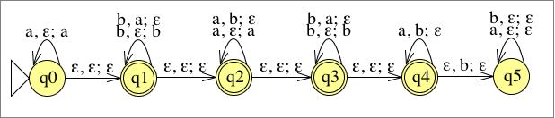

# Übung 9
## Aufgabe 1:
**Geben Sie eine Turingmaschine an, die die Sprache $L(a^*b^*a^*b^*a^*)$ akzeptiert.**

---
## Aufgabe 2:
**Zeigen Sie, dass die Sprache $L = \{a^{2^k} | k \leq 0\}$ nicht kontextfrei ist.**

---
## Aufgabe 3:
**Beweisen oder widerlegen Sie: Die Sprache $L=\{a^ib^ja^kb^la^m |i+k+m= j+l\}$ ist kontextfrei.**

---
## Aufgabe 4:
**Begründen Sie jeweils ihre Antwort auf die folgenden Fragen:**
a) **Ist die Klasse der rekursiven Sprachen abgeschlossen unter Konkatenation?**
b) **Ist die Klasse der rekursiven Sprachen abgeschlossen unter Kleene Star?**

---
## Aufgabe 5:
**Sei M die durch folgendes Zustandsübergangsdiagramm gegebene Turingmaschine, die die Sprache $L = \{wcw | w \in \{a,b\}^*\}$ akzeptiert. In der Vorlesung haben wir ein Konstruktionsverfahren kennengelernt, um aus M eine Grammatik G zu erzeugen mit $L(G) = L(M) = L$. Geben Sie eine Ableitung für das Wort *abcab* in der entsprechend des Verfahren konstruierten Grammatik G an. Sie brauchen hier nur jene Produktionsregeln der Grammatik zu erzeugen, die Sie für die Ableitung benötigen.**

---
## Aufgabe 6:
**Sei $\Sigma=\{a,b\}$ und sei $f:\Sigma^* \rightarrow \Sigma^* $ mit:**
$$f(w) = w^R$$
**Geben Sie eine Turingmaschine an, die die Funktion f berechnet.**
